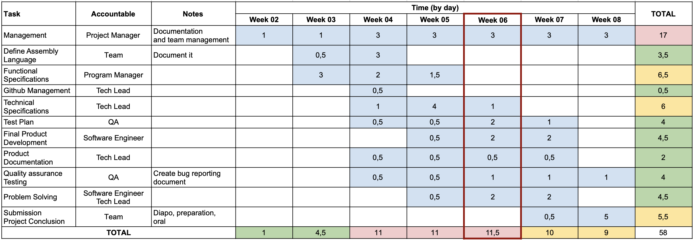
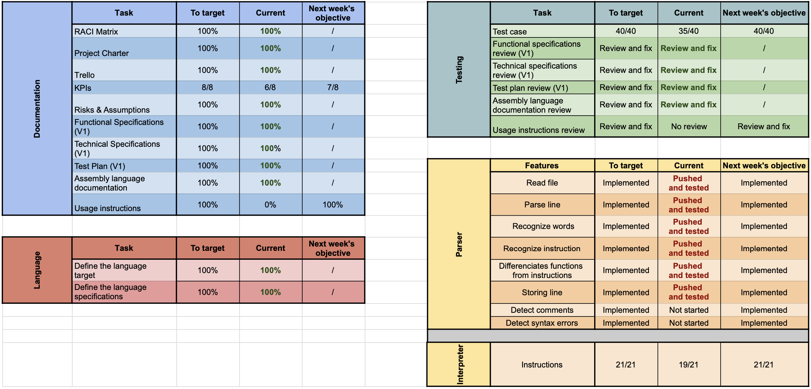

# Weekly Report - 03/12/2023 - 03/18/2024

## Project Overview

- **Project Name:** Virtual Processor
- **Project Manager:** Laura-Lee Hollande
- **Project time (hours):** 9h15

### Project summary

The team held its regular meeting to discuss on the following tasks and share the information with the teammates who were missing the previous week.

We also held a code presentation and organize a code review to discuss about the code.

The deadline for the test plan. The team succeeded to deliver the [test plan](https://github.com/algosup/2023-2024-project-3-virtual-processor-team-8/blob/main/Documents/Specs/Test-Plan.md) on time.

We managed some files name issues and updated the gitignore.

## Project Key parameters

<details>

<summary>💡 Keys</summary>

1. **Scope:**
   - **On:** The project is proceeding within the defined scope without significant deviations.
   - **At Risk:** There are potential scope creep issues or uncertainties that may impact the project's boundaries.
   - **Halted:** The project has temporarily stopped due to scope-related challenges or changes.
  
2. **Schedule:**
   - **On:** The project is progressing according to the planned schedule.
   - **At Risk:** There are concerns about meeting the scheduled deadlines or milestones.
   - **Halted:** The project schedule has come to a temporary stop, possibly due to external factors or critical issues.

3. **Risks[^1]:**
   - **On:** The identified risks are being effectively managed, and mitigation strategies are in place.
   - **At Risk:** New risks have emerged, or existing risks are not being adequately addressed.
   - **Halted:** The project has stopped or is on hold due to high-risk factors that need resolution.

4. **Issues[^2]:**
   - **On:** Issues are being promptly addressed, and resolution is progressing well.
   - **At Risk:** There are issues that pose a threat to the project's progress and need attention.
   - **Halted:** The project has come to a stop due to critical unresolved issues.

5. **Quality:**
   - **On:** The project is meeting or exceeding quality standards.
   - **At Risk:** There are concerns about the quality of deliverables or processes.
   - **Halted:** The project has temporarily halted due to severe quality issues that need resolution.

</details>

| Component | Status | Comments       |
| --------- | ------ | -------------- |
| Scope     | On     | All Ok         |
| Schedule  | On     | No delays      |
| Risks     | /      | No major risk  |
| Issues    | /      | No major issue |
| Quality   | On     | All Ok         |

## Project Risks and Issues (Top 5)

| Risk/Issues | Description                             | Owner                           | Status |
| ----------- | --------------------------------------- | ------------------------------- | ------ |
| Risk 1      | Absence of some teammates due to illnes | Laura-Lee Hollande, Evan Uhring | Closed |
| Issue 1     | file name problem src/Src               | Laurent Bouquin                 | Closed |

## Project Schedule

This schedule refers to the [Gantt Chart](https://github.com/algosup/2023-2024-project-3-virtual-processor-team-8/blob/management/Management/TeamManagement/ganttCharter.pdf) of this project.



```The current week is highlighted in red and the weeks are based on the real time weeks number.```

## Key Performance Indicator[^3]

<details>

<summary>💡 Keys</summary>

1. **Documentation KPIs:**
   - **0%:** Nothing done.
   - **10%:** Started.
   - **70%:** Written or set up.
   - **100%:** Validated by the group.

2. **Testing KPIs:**
   - **Test case:** Number of test that passed.
   - **No review:** No review was initiated.
   - **Review:** The documentation has been reviewved.
   - **Review and fix:** The documentation has been reviewved and all the GitHub Issues[^4] are closed.

3. **Language KPIs:**
   - **0%:** Nothing done.
   - **10%:** Started.
   - **70%:** Difined.
   - **100%:** Validated by the group.

4. **Parser & Interpreter KPIs:**
   - **Not started:** We have not started working on the feature.
   - **On going:** We have started working on the feature.
   - **Pushed:** The feature is done and push in the ```dev branch```, ready to be tested.
   - **Pushed and tested:** The feature is tested, ready to be merged.
   - **Implemented:** The feature has been coded, pushed in the ```dev branch```, tested and merged in the main branch with no conflict.
   - **Instrustions:** Number of instructions that worked and was tested.

</details>



## Next week Action Plan

| Action                                        | Note                         | Owner                                                      | Status | End Date |
| --------------------------------------------- | ---------------------------- | ---------------------------------------------------------- | ------ | -------- |
| Writing the usage instructions                | Need to be done and reviewed | Ian Laurent, Pierre Gorin, Evan Uhring                     | To do  | 02/23/24 |
| Iniate some test of our code with other teams |                              | Laurent Bouquin                                            | To do  | 02/23/24 |
| Finish the last instructions and test         |                              | Victor Leroy, Manech Laguens, Laurent Bouquin, Evan Uhring | Doing  | 02/23/24 |
| Merge our work in the main branch             |                              | Pierre Gorin, Laura-Lee Hollande                           | To do  | 02/23/24 |

---

[^1]: Risk is any unexpected event that can affect your project — for better or for worse. Risk can affect anything: people, processes, technology, and resources. [...] Risks are events that might happen, and you may not be able to tell when.
*source : [Wrike](https://www.wrike.com/project-management-guide/faq/what-is-risk-in-project-management/)*
[^2]: Issues are things you know you’ll have to deal with, and may even have an idea of when they’ll occur.
*source : [Wrike](https://www.wrike.com/project-management-guide/faq/what-is-risk-in-project-management/)*
[^3]: A quantifiable measure of performance over time for a specific objective. KPIs provide targets for teams to shoot for, milestones to gauge progress, and insights that help people across the organization make better decisions.
*source : [Qlik](https://www.qlik.com/us/kpi#:~:text=KPI%20stands%20for%20key%20performance,the%20organization%20make%20better%20decisions.)*
[^4]: GitHub issue is a tool to track ideas, feedback, tasks, or bugs for work on GitHub.
*source : [Github](https://docs.github.com/en/issues/tracking-your-work-with-issues/about-issues)*