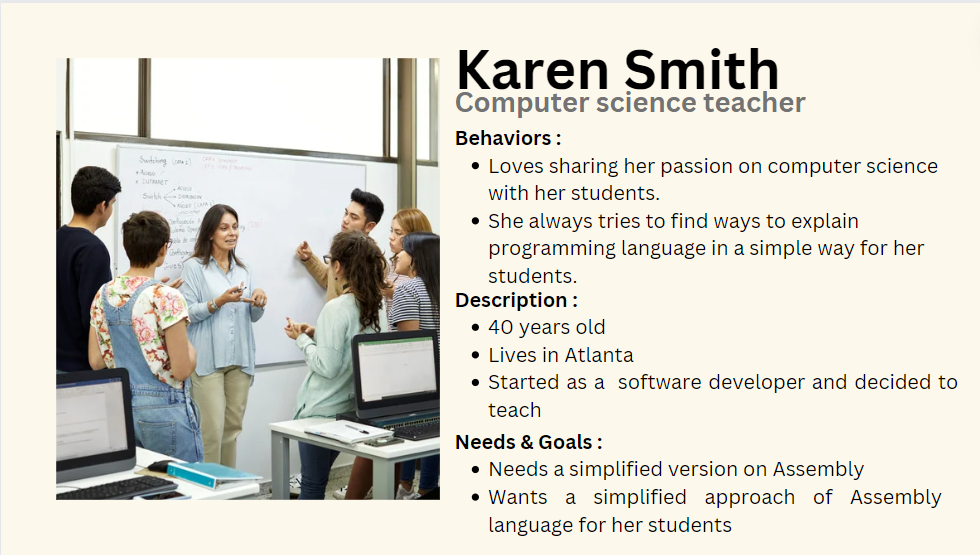
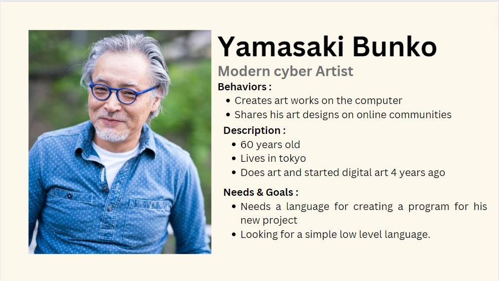

# Functional specification

## Table of content 

- [Functional specification](#functional-specification)
  - [Table of content ](#table-of-content-)
- [A. Introduction](#a-introduction)
  - [1. Project overview](#1-project-overview)
  - [2. Project definition](#2-project-definition)
    - [**Project vision**](#project-vision)
    - [**Objectives**](#objectives)
    - [**Scopes**](#scopes)
    - [**Deliverables**](#deliverables)
    - [**Personas definition**](#personas-definition)
      - [Persona 1 :](#persona-1-)
      - [Persona 2 :](#persona-2-)
  - [3. Project organization](#3-project-organization)
    - [**Stakeholders**](#stakeholders)
    - [**Project reviewers**](#project-reviewers)
  - [4. Project Plan](#4-project-plan)
    - [**Retro-planning**](#retro-planning)
    - [**Milestones**](#milestones)
    - [**Resources and tools**](#resources-and-tools)
    - [**Assumptions and constraints**](#assumptions-and-constraints)
- [B. Functional Requirements](#b-functional-requirements)
  - [1. Customer's requirements](#1-customers-requirements)
  - [2. Objectives and loss conditions](#2-objectives-and-loss-conditions)
  - [3. Operability](#3-operability)
  - [4. Reliability](#4-reliability)
  - [5. Product requirements](#5-product-requirements)
  - [6. Emulators features breakdown](#6-emulators-features-breakdown)
  - [7. Terminal](#7-terminal)
  - [8. Other](#8-other)
  - [9. Use Cases Analysis](#9-use-cases-analysis)
  - [10. Functional Analysis](#10-functional-analysis)
- [C. Non-functional requirements](#c-non-functional-requirements)
  - [1. Response and Performance](#1-response-and-performance)
  - [2. Recovery](#2-recovery)
  - [3. Delivery](#3-delivery)
  - [4. Maintainability](#4-maintainability)
  - [5. Security](#5-security)
- [D. Conclusion](#d-conclusion)
  - [Glossary](#glossary)

# A. Introduction
As for the overview of the project, the client (ALGOSUP : Franck JEANNIN) has demanded us to create an emulator on which we will have to run an assembly[^4] ("[...].asm") file on it. The goal of the project is to create a virtual processor[^3] and an interpreter for running assembly code on that processor. The final product must be developed in plain, portable and coded in C language[^5] without the use of any external library beside C standard libraries. As for the compiler the client has recommended to use "gcc[^1]" and "Visual studio code[^2]" as IDE (integrated development environment).
As for the operating system the final product will run on MacOS and Windows, and the devices used to develop the product are :

    - Apple MacBook Air 2021, equipped with the "M1" chip running on "Ventura 13.0" MacOS version.

    - Lenovo ThinkPad 2023, equipped with "13th Gen Intel(R) Core(TM) i7-1355U", running on "Windows 11 pro". 

    - Lenovo ThinkBook 2021, equipped with "11th Gen Intel(R) Core(TM) i7-1165G7", running on "windows 11 pro".

The team is composed with 7 members each having a designated role. 

| Team members of team 8 for this project ||
|:-|:-|
| **Name** | **Role** |
| Laura-Lee HOLLANDE| Project Manager |
| Ian LAURENT | Program Manager |
| Pierre GORIN | Technical Leader |
| Manech LAGUENS | Software Engineer |
|  Victor LEROY | Software Engineer |
| Laurent BOUQUIN | Quality Assurance |
| Evan UHRING | Quality Assurance |

## 1. Project overview
Our team was asked by ALGOSUP International software development school to create an emulator coded in C language[^5], which will have to be able to run an assembly code. 

## 2. Project definition

### **Project vision**
The project envisions the creation of a virtual processor and interpreter, facilitating the execution of assembly code written in a custom assembly language. The virtual processor aims to provide a platform for running low-level code efficiently. 

### **Objectives**
Developing a virtual processor capable of executing assembly code is the principal objective.
Being able to create an interpreter for the custom assembly language.
It should implement a set of essential assembly instructions, including arithmetic, logical operations, and control flow.
The team will have to ensure it's portability by developing the project in plain C language, utilizing standard libraries, and recommending specific development tools.
To assure that the objectives were achieved, making unit tests throughout the development phase will allow the team to detect as many errors in the code as possible.

### **Scopes**
The project encompasses the design and development of a virtual processor, interpreter, and associated assembly language. The primary focus is to create a versatile platform capable of executing assembly code efficiently. The scope also extends to consider the potential future applications of the project, opening avenues for integration with broader systems, educational purposes, or as a foundation for building specialized computing environments.
Develop a software able to proceed some basic commands that are written based on an assembly syntax that we developed.

### **Deliverables**
We will have to make sure to deliver the final product in the deadlines that were given by the client. To ensure that the final product will be ready to present, the team has to ensure that all the milestones are achieved and done on time.

As for this document (<n>Functional specification</n>), the due date is **01/30/24** at 5pm and should contain all the information regarding the overview of the project and all the success keys to deliver the final product to the client. This document must also contain the outlining of assembly language, explanation of the virtual processors and it's functions, and the interpreter's specifications.

A <u>Technical Specification</u> is mandatory for this project, and the due date is **02/09/24** 5pm. This document should provide insights into the implementation details, data structures, and the types of algorithms used without giving out the code. It will have to specify the technical aspects of the final product keeping it understandable for the client. Keeping terms employed understandable with clear explanations if needed, will allow to maintain transparency of the advancement of the project.

Testing is key to make sure that the final product is presentable to the client and meets its expectations. These tests will be done within the team but also with outside insights such as other external individuals. These tests will be specified in a document named a <u>Test plan</u>. In this document, all tests that have been done on the product must be detailed with a clear understanding on what lead to the issue, its type meaning either if it's a technical issue or other, and other detailed information to allow to keep track of the issues for the client but also within the team members.

As for the <u>final product</u>, the deadline being **02/23/24**, this should be the final version of the product. This version should be fully functional with all the features that was mentioned in this document. This version should obviously meet the satisfaction of the client and respond to the client's needs. This version will be tested before being presented to the client, and should include the virtual processor, interpreter and the associated tools.

### **Personas definition**

#### Persona 1 :

#### Persona 2 :

## 3. Project organization

### **Stakeholders**
The stakeholders for this project are the staff of <u>ALGOSUP International software development school</u> represented by <u>Franck JEANNIN</u> backed by Eric LARCHEVEQUE, Natacha BOEZ and Jean-Philippe GRASSE.

### **Project reviewers**
The project reviewers in team 8 are : 
|*Name*|*Role*|
|:-|:-|
Evan UHRING|Quality assurance
Laurent BOUQUIN|Quality assurance
Laura-Lee HOLLANDE | Project Manager
Pierre GORIN | Technical leader

## 4. Project Plan

### **Retro-planning**

### **Milestones**

|Phases :|Pre-Development|||Development |||Post-Development|
|:-|:-|:-|:-|:-|:-|:-|:-|
|Tasks :|Functional specification|Define Assembly language|Technical specification|Test Plan|Implement Virtual Processor|Write Assembly Programs as Unit Tests|Test Phase|
|Due Date :|01/30/24|...|02/09/24|02/16/24|...|...|...|
|Desired end date :|01/30/24|01/30/24|02/09/24|02/16/24|02/16/24|02/16/24|02/16/24 -> Final deadline (02/23/24)

### **Resources and tools**
Development environment: VS code, GitHub
Test environment: unit tests on VScode, test plan GitHub, Issues with GitHub issues
Management environment: Trello, Slack 

### **Assumptions and constraints**
Assuming that the client has a MacOs or a Windows device and a compatible OS.
The constraints can occur if the device's OS is not compatible with the virtual processor, or if there is an incompatibility of the version of C language between the developed product and the installed version of C of the client. Client's device runs on Linux. Client's device has a limited amount of storage and memory available. 

# B. Functional Requirements

## 1. Customer's requirements
The main customer's requirement is to build a fully functional virtual processor that will be able to run an assembly code. This processor will have to be in x86 32 bits environment.

## 2. Objectives and loss conditions
The objectives are to respond to the demand of the client. Meaning that all the customer's requirements are fulfilled and all mentioned aspects should be fully functional and meet the satisfaction of the client. 

As for the loss conditions will be determined by several factors such as, the final product being not functional, and not meeting the clients expectations. Deadlines are another factor of loss condition, if the team doesn't manage to deliver to the client within the deadlines it will be considered a deadline. 

## 3. Operability
The virtual processor will have to run on all software devices (Windows, MacOs) and any recent windows or MacOs running devices.

## 4. Reliability

The virtual processor relies on the internal memory of the client's device. The final product will strategically utilize the device's internal memory, specifically the Random Access Memory (RAM), optimizing task execution for heightened efficiency and responsiveness. This deliberate integration signifies a substantial advancement in enhancing computational capabilities on the client's device.

## 5. Product requirements
The first main requirement being to define the syntax used to translate an ".asm" file, meaning that the team has to define the main commands from assembly language to the team's syntax. This syntax defined by the team will be documented and added to this team's Github repository for it to be available for consultation by the client.
The following link will direct you to the document with all the syntax that has been chosen by the team : //LINK

## 6. Emulators features breakdown
Not for now, exploring possibilities.

## 7. Terminal
This is how the virtual processor should be presented on the user's device. It's a visual illustration of the product but there is a possibility that the visual might change. Up to now the product will run on the terminal. 

## 8. Other
The developing team will have to make sure to keep a virtual processor that is compatible with as many operating systems and devices to make sure to allow a large amount of people to be able to use our product. Which is why the quality assurance team will make sure to test the compatibility of our product on as many devices as possible.

## 9. Use Cases Analysis
| Use Case Number | Name | Description | Actor(s) | Pre-Conditions | Flow of Events | Post-Conditions | Exit Criteria | Notes & Issues |
|---|---|---|---|---|---|---|---|---|
| 1 | Launch executable file | The user wants to run an ".asm" file. | User | The processor is installed successfully on the user's device. | -The user launches the ".exe" file. -The processor will launch. | The user is able to give a path to the ".asm" file or drag and drop the file. | The user is able to run the processor on its device. |- N.S.T.R. [^6] |
| 2 | Running program |The user's interaction with the processor will be based on the terminal.| Users | The user has the program mounted and the asm code doesn't have any errors. | The processor will locate the file and run it through the program. |- The program will return what is in the ".asm" file.| The user is able to run its ".asm" file.| - N.S.T.R.
| 3 | Error return | The user will run its file in the processor. | Users | the user has the program mounted. | - The program will run the ".asm" file and detect any error (e.g. syntax error, file not found)| -The processor will return error.| The user's file contains any error and will display an error message on the screen.|- N.S.T.R

## 10. Functional Analysis
The main functional requirement of the processor is that it is able to run an ".asm" file where the client will be able to see the return of its program. The processor will read the file and run it on the code that was elaborated by the team and show the result of the code of the user. 
These functional requirements will demand several steps such as the import of the user's file or the mounting of the processor on the device of the user.

# C. Non-functional requirements
## 1. Response and Performance
Assembly being a low level language, the file will be run by the processor depending on the optimization of the code elaborated by the team. The team will make sure that the code is as optimized for the running time of the users code will be as fast as possible.

## 2. Recovery
In first case scenario the processor should reset to default state in case of crash.
In second case scenario the user's code will be stored locally so that the user will not have to define the directory to the file again.
Ideally the processor will be able to run the file again without any visible flaw.

## 3. Delivery
Delivery of the team's final product must be within the deadline defined by the client, this final version should be fully functional and responding to the clients needs.

## 4. Maintainability
The processor being an executable file and stored locally on the device of the user, the maintainability of the product is not an issue if the installation of the final product was correctly done taking in count the factors of mounting the program in the terminal.

## 5. Security
The processor is stored locally on the device of the user and the security of the product will depend on the user's device, if it contains any device or if the user's device got hacked. Due to being an downloadable file from GitHub, the file will be an open source product. The team will not include any malware in the folders that will have to be downloaded by the user. These files won't be an issue in terms of security for the user.

# D. Conclusion
To conclude, this project was given to the team by ALGOSUP international software development school represented by Franck JEANNIN and backed by the other staff members. This project's purpose is to code a processor with C language linked to the previous courses given on Assembly language. The reason being that the project will have to run an Assembly code on a virtual processor coded in C language. This project will allow all ALGOSUP students to understand how a virtual works. 
The team will develop the virtual processor within the deadline and keep the client informed on the advancement of the project.
Maintaining transparency between the client and the team will allow to understand the true needs of the client.

## Glossary 
[^1]: GCC, short for GNU Compiler Collection, is a free and open-source compiler system produced by the GNU Project. It is used to compile source code from various programming languages, including C, C++, Objective-C, Fortran, Ada, and others. In simple terms, it translates the code written by developers into a format that can be understood and executed by a computer.

[^2]:  Visual Studio Code, often referred to as VS Code, is a free and open-source code editor developed by Microsoft. It supports a variety of programming languages and features, including syntax highlighting, intelligent code completion, snippets, code refactoring, and embedded Git. Users can also extend its functionality using extensions. It's designed to be lightweight yet powerful, and it can be used on Windows, macOS, and Linux operating systems.

[^3]: A virtual processor is a representation of a physical processor to the operating system of a logical partition that uses shared processors.

[^4]: Assembly language is a low-level programming language that allows direct communication with the computer hardware. It uses mnemonics, or symbolic names, to represent the machine code instructions that the processor can execute.

[^5]: C is an imperative procedural language, supporting structured programming, lexical variable scope, and recursion, with a static type system. It was designed to be compiled to provide low-level access to memory and language constructs that map efficiently to machine instructions, all with minimal runtime support. 

[^6]: Acronym for "Nothing significant to report".