<div align="center">

# Technical Specification

---
**Title:** Virtual Processor Project - Team 8

**Author:** Pierre GORIN

**Team:** Team 8

**Reviewer(s):** Laurent BOUQUIN, Evan UHRING

**Created on:** January 22<sup>nd</sup>, 2024

**Last updated:** February 9<sup>th</sup>, 2024

---

### Approvals

| Reviewer           | Role              | Approved | Date       |
| ------------------ | ----------------- | -------- | ---------- |
| Laurent BOUQUIN    | Quality Assurance |          |            |
| Evan UHRING        | Quality Assurance | ✅        | 02/09/2024 |
| Laura-Lee HOLLANDE | Project Manager   | ✅        | 02/09/2024 |
| Ian LAURENT        | Program Manager   |          |            |
| Pierre GORIN       | Technical Leader  |          |            |
| Manech LAGUENS     | Software Engineer | ✅      | 02/09/2024 |
| Victor LEROY       | Software Engineer |          |            |

</div>

<br><details>
<summary><h3 id="toc"> Table of Contents <i>(Click to expand)</i></h3></summary>

- [Technical Specification](#technical-specification)
    - [Approvals](#approvals)
- [1 - Overview](#1---overview)
  - [1.1 - Purpose](#11---purpose)
    - [1.1.1 - Goals](#111---goals)
    - [1.1.2 - Objectives](#112---objectives)
    - [1.1.3 - Success Criteria](#113---success-criteria)
  - [1.2 - Stakeholders](#12---stakeholders)
    - [1.2.1 - Project Team](#121---project-team)
    - [1.2.2 - Client](#122---client)
  - [1.3 - Usage](#13---usage)
    - [1.3.1 - Requirements](#131---requirements)
    - [1.3.2 - Installation](#132---installation)
      - [1.3.2.1 - Installation with Bash](#1321---installation-with-bash)
      - [1.3.2.2 - Installation with GitHub Desktop](#1322---installation-with-github-desktop)
    - [1.3.3 - Running](#133---running)
  - [1.4 - Scope](#14---scope)
    - [1.4.1 - In Scope](#141---in-scope)
    - [1.4.2 - Out of Scope](#142---out-of-scope)
- [2 - Overall Description](#2---overall-description)
  - [2.1 System Environment](#21-system-environment)
    - [2.1.1 - Hardware](#211---hardware)
    - [2.1.2 - Software](#212---software)
  - [2.2 - Project Folder Structure](#22---project-folder-structure)
  - [2.3 - Conventions](#23---conventions)
    - [2.3.1 - Naming Conventions](#231---naming-conventions)
      - [2.3.1.1 Folders](#2311-folders)
      - [2.3.1.2 Files](#2312-files)
      - [2.3.1.3 Variables](#2313-variables)
      - [2.3.1.4 Constants](#2314-constants)
      - [2.3.1.5 Functions](#2315-functions)
      - [2.3.1.6 Tests](#2316-tests)
    - [2.3.2 - Formatting Conventions](#232---formatting-conventions)
      - [2.3.2.1 - Indentation](#2321---indentation)
      - [2.3.2.2 - Line Length](#2322---line-length)
      - [2.3.2.3 - Line Breaks](#2323---line-breaks)
      - [2.3.2.4 - Comments](#2324---comments)
  - [2.4 - Assembly Syntax](#24---assembly-syntax)
    - [2.4.1 - Registers](#241---registers)
      - [2.4.1.1 - Storing an immediate value into a register](#2411---storing-an-immediate-value-into-a-register)
      - [2.4.1.2 Copying the value of a register into another register](#2412-copying-the-value-of-a-register-into-another-register)
      - [2.4.1.3 Reading the value from the memory to a register](#2413-reading-the-value-from-the-memory-to-a-register)
      - [2.4.1.4 Writing the value from a register to the memory](#2414-writing-the-value-from-a-register-to-the-memory)
    - [2.4.2 - Jumping to a label](#242---jumping-to-a-label)
      - [2.4.2.1 - Jumping unconditionally](#2421---jumping-unconditionally)
      - [2.4.2.2 - Jumping conditionally (where "cc" is a condition code)](#2422---jumping-conditionally-where-cc-is-a-condition-code)
    - [2.4.3 - Comparing registers](#243---comparing-registers)
    - [2.4.4 - Calling a subroutine](#244---calling-a-subroutine)
    - [2.4.5 - Returning from a subroutine](#245---returning-from-a-subroutine)
    - [2.4.6 - Arithmetic operations](#246---arithmetic-operations)
      - [2.4.6.1 - Addition](#2461---addition)
      - [2.4.6.2 - Subtraction](#2462---subtraction)
      - [2.4.6.3 - Multiplication](#2463---multiplication)
      - [2.4.6.4 - Division](#2464---division)
    - [2.4.7 - Logical operations](#247---logical-operations)
      - [2.4.7.1 - Logical AND](#2471---logical-and)
      - [2.4.7.2 - Logical OR](#2472---logical-or)
      - [2.4.7.3 - Logical XOR](#2473---logical-xor)
      - [2.4.7.3 - Logical NOT](#2473---logical-not)
    - [2.4.8 - Comments](#248---comments)
- [3 - Software Architecture](#3---software-architecture)
  - [3.1 - Parsing](#31---parsing)
    - [3.1.1 - `parser.c`](#311---parserc)
    - [3.1.2 - `parser.h`](#312---parserh)
    - [3.1.3 - `tests_parser.c`](#313---tests_parserc)
    - [3.1.4 - `tests_parser.h`](#314---tests_parserh)
  - [3.2 - Interpreting](#32---interpreting)
    - [3.2.1 - `interpreter.c`](#321---interpreterc)
    - [3.2.2 - `interpreter.h`](#322---interpreterh)
    - [3.2.3 - `tests_interpreter.c`](#323---tests_interpreterc)
    - [3.2.4 - `tests_interpreter.h`](#324---tests_interpreterh)
  - [3.3 - Main](#33---main)
    - [3.3.1 - `main.c`](#331---mainc)
    - [3.3.2 - `main.h`](#332---mainh)
      - [3.3.3 - `tests_main.c`](#333---tests_mainc)
    - [3.3.4 - `tests_main.h`](#334---tests_mainh)
    - [3.4 - Overall Flow](#34---overall-flow)
      - [3.4.1 - Sequence Diagram](#341---sequence-diagram)
      - [3.4.2 - Flowchart Diagram](#342---flowchart-diagram)
      - [3.4.2 - Class Diagram](#342---class-diagram)
- [4 - End Matter](#4---end-matter)
  - [4.1 - Contributors](#41---contributors)
  - [4.2 - Related Documents](#42---related-documents)
  - [4.3 - License](#43---license)
  - [4.4 - References](#44---references)
    - [4.4.1 - Tools](#441---tools)
    - [4.4.2 - References](#442---references)
  - [4.5 - Glossary](#45---glossary)
  - [4.6 - Footnotes](#46---footnotes)

</details>

---

# 1 - Overview

## 1.1 - Purpose

[*(Back to top)*](#toc)

### 1.1.1 - Goals

This project aims to develop a virtual processor[^1] and an interpreter[^2] for a custom assembly language[^3]. Using only standard C[^4] libraries for wide compatibility, the primary goal is to design a minimal assembly language and build a C program interpreter capable of executing and error-checking assembly code. This solution is intended to serve educational purposes and software developers interested in low-level programming[^5] and processor emulation[^6]. The project combines technical innovation with practical application, focusing on creating a user-friendly and educational tool in the field of computer architecture.

### 1.1.2 - Objectives

The project objectives are as follows:

- Design a minimal assembly language with a sufficient set of instructions[^7].
- Develop an interpreter capable of executing assembly code.
- Develop an interpreter capable of error-checking assembly code.
- Make the interpreter user-friendly and easy to use.
- Make the interpreter compatible with a wide range of operating systems[^8].

### 1.1.3 - Success Criteria

The project will be considered successful if the following criterias are met:

- The interpreter is capable of executing assembly code.
- The interpreter is compatible with the most common operating systems.
- 50% of the set of instructions are implemented.

## 1.2 - Stakeholders

[*(Back to top)*](#toc)

This project is for educational purposes and is not intended for commercial use. The project team will be responsible for the development of the project and the client will be responsible for providing feedback and guidance throughout the development process.

### 1.2.1 - Project Team

| Name               | Role              | GitHub                                                    |
| ------------------ | ----------------- | --------------------------------------------------------- |
| Laura-Lee HOLLANDE | Project Manager   | [Laura-Lee's GitHub](https://github.com/lauraleehollande) |
| Ian LAURENT        | Program Manager   | [Ian's GitHub](https://github.com/Ianlaur)                |
| Pierre GORIN       | Technical Leader    | [Pierre's GitHub](Pierre2103)                             |
| Victor LEROY       | Software Engineer | [Victor's GitHub](https://github.com/Victor-Leroy)        |
| Manech LAGUENS     | Software Engineer | [Manech's GitHub](https://github.com/Manech-Laguens)      |
| Laurent BOUQUIN    | Quality Assurance | [Laurent's GitHub](https://github.com/Ianlaur)            |
| Evan UHRING        | Quality Assurance | [Evan's GitHub](https://github.com/Evan-UHRING)           |

### 1.2.2 - Client

| Name             | Role                 | Contact                                                         |
| ---------------- | -------------------- | --------------------------------------------------------------- |
| ALGOSUP          | Client               | [Website](https://www.algosup.com/)                             |
| Franck JEANNIN   | ALGOSUP's Co-Founder | [LinkedIn](https://www.linkedin.com/in/franck-jeannin/)         |
| Eric LARCHEVEQUE | ALGOSUP's Co-Founder | [LinkedIn](https://www.linkedin.com/in/ericlarch/)              |
| Natacha BOEZ     | ALGOSUP's Co-Founder | [LinkedIn](https://www.linkedin.com/in/natacha-boez-913a33167/) |

## 1.3 - Usage

[*(Back to top)*](#toc)

The interpreter is designed to be user-friendly and easy to use. The interpreter will be compatible with the most common operating systems and will be capable of executing assembly code and error-checking assembly code. The interpreter will be capable of displaying the output of the assembly code.
Following are the instructions to install and run the interpreter.

### 1.3.1 - Requirements

To run your custom assembly code, you will need to install the following dependencies:

- [VS Code](https://code.visualstudio.com/download) - Visual Studio Code[^9] is a free source-code editor made by Microsoft for Windows, Linux and macOS.
- [C/C++ for Visual Studio Code](https://marketplace.visualstudio.com/items?itemName=ms-vscode.cpptools) - C/C++ for Visual Studio Code is an extension for VS Code that provides IntelliSense, debugging, and code browsing support for C and C++ code.
- [GCC](https://gcc.gnu.org/install/) - GCC[^11], the GNU Compiler Collection, is a free collection of compilers[^12] for C, C++, Objective-C, Fortran, Ada, Go, and D programming languages.

The software is developed using the 23<sup>rd</sup> version of the C language.

### 1.3.2 - Installation

To install the interpreter, you will need to follow these steps:

1. Clone the repository on your local machine, or download the repository as a ZIP file and extract it.

#### 1.3.2.1 - Installation with Bash

Open a terminal and run the following commands:

If you are on macOS:

```bash
git clone https://github.com/algosup/2023-2024-project-3-virtual-processor-team-8.git
cd 2023-2024-project-3-virtual-processor-team-8
```

#### 1.3.2.2 - Installation with GitHub Desktop

Open GitHub Desktop and click on `File > Clone Repository`. Select the URL tab and enter the following URL:

```bash
https://github.com/algosup/2023-2024-project-3-virtual-processor-team-8.git
```

Then click on `Clone` and click on `Repository > Open in Visual Studio Code`.

### 1.3.3 - Running

To run the interpreter, you will need to follow these steps:

1. Open the repository in VS Code.
2. Navigate to the `src` folder.
3. Modify the `code.asm` file to include your custom assembly code.
4. Open the terminal in VS Code.
5. Run the following command: `gcc -o main main.c `
6. Then type this command to run code.asm file: `./main code.asm`

*Note: You can use an other `.asm` file, you just need to replace `code.asm` by the name of your file.*

## 1.4 - Scope

[*(Back to top)*](#toc)

### 1.4.1 - In Scope

The project will include the following features:

- Basic assembly language with a minimal set of instructions.
- Interpreter capable of executing assembly code.
- Interpreter capable of error-checking assembly code.
- User-friendly interface.
- Compatibility with the most common operating systems.

### 1.4.2 - Out of Scope

The project will not include the following features:

- Advanced assembly language with a complex set of instructions.
- Graphical user interface.
- Debugging tools.
- Compatibility with specific hardware configurations.
- Compatibility with other programming languages.
- Real-time performance analysis[^13].
- Advanced memory management[^14].

---

# 2 - Overall Description

## 2.1 System Environment

[*(Back to top)*](#toc)

### 2.1.1 - Hardware

The interpreter will be compatible with the most common hardware configurations, and will be tested on the following hardware:

| Specification    | Lenovo ThinkBook 14  | Lenovo ThinkBook 14  | Lenovo ThinkPad 2023 | Apple MacBook Air M1 2020 | Apple MacBook Air M1 2020 |
| ---------------- | -------------------- | -------------------- | -------------------- | ------------------------- | ------------------------- |
| Processor        | Intel Core i7-1065G7 | Intel Core i7-1165G7 | Intel Core i7-1355U  | Apple Silicon M1          | Apple Silicon M1          |
| RAM[^15]         | 16 GB                 | 16 GB                | 16 GB                 | 8 GB                      | 8 GB                      |
| Operating System | Windows 11 Pro       | Windows 11 Pro       | Windows 11 Pro       | macOS Ventura             | macOS Sonoma              |

### 2.1.2 - Software

The interpreter will be compatible with the most common operating systems, and will be tested on the following operating systems:

| Operating System | Windows 11 Pro | macOS Ventura | macOS Sonoma |
| ---------------- | -------------- | ------------- | ------------ |
| Version          | 22H2           | 13.0          | 14.3         |

## 2.2 - Project Folder Structure

[*(Back to top)*](#toc)

The project will be organized in the following folder structure:

```bash
~ 2023-2024-project-3-virtual-processor-team-8  # 🌳 Root folder
├── Bin                                         # 📁 Binary folder
├── Tests                                       # 📁 Tests folder
│   ├── Headers                                     # 📁 Tests Header folder
│   │   ├── tests_interpreter.h                         # 📄 Interpreter test C header file
│   │   ├── tests_main.h                                # 📄 Main test C header file
│   │   └── tests_parser.h                              # 📄 Parser test C header file
│   ├── tests_interpreter.c                         # 📃 Interpreter test C file
│   ├── tests_main.c                                # 📃 Main test C file
│   └── tests_parser.c                              # 📃 Parser test C file
├── Docs                                        # 📁 Documentation folder
│   ├── Management                                  # 📁 Management folder
│   │   ├── Team-Management                             # 📁 Team management folder
│   │   │   ├── Gantt-Charter.pdf                           # 📖 Gantt chart file
│   │   │   └── Racii.md                                    # 📖 RACII file
│   │   ├── Weekly-Reports                              # 📁 Weekly reports folder
│   │   │   ├── Img                                         # 📁 Images folder
│   │   │   ├── Weekly-Report-1.md                          # 📖 Weekly report file
│   │   │   ├── Weekly-Report-2.md                          # 📖 Weekly report file
│   │   │   └── [etc...]                                    # 📖 Others Weekly report file
│   │   ├── Project-Charter.md                          # 📖 Project charter file
│   │   └── Risk-Management-Plan.md                     # 📖 Risk management plan file
│   └── Specs                                   # 📁 Specifications folder
│       ├── Img                                     # 📁 Images folder
│       │   ├── Functional-Specifications               # 📁 Functional specification images folder
│       │   │   ├── 1.png                                   # 🖼️ Functional specification image
│       │   │   ├── 2.png                                   # 🖼️ Functional specification image
│       │   │   └── [etc...]                                # 🖼️ Others Functional specification image  
│       │   ├── Technical-Specifications                # 📁 Technical specification images folder
│       │   │   ├── 1.png                                   # 🖼️ Technical specification image
│       │   │   ├── 2.png                                   # 🖼️ Technical specification image
│       │   │   └── [etc...]                                # 🖼️ Others Technical specification image
│       │   └── Test-Plan                               # 📁 Test plan images folder
│       │       ├── 1.png                                   # 🖼️ Test plan image
│       │       ├── 2.png                                   # 🖼️ Test plan image
│       │       └── [etc...]                                # 🖼️ Others Test plan image
│       ├── Functional-Specifications.md            # 📖 Functional specification file
│       ├── Manual.pdf                              # 📖 Manual of our Assembly
│       ├── Technical-Specifications.md             # 📖 Technical specification file
│       └── Test-Plan.md                            # 📖 Test plan file
├── Src                                         # 📁 Source code folder
│   ├── code.asm                                    # 📝 Assembly code file
│   ├── Headers                                     # 📁 Header Folder
│   │   ├── interpreter.h                               # 📄 Interpreter C header file
│   │   ├── main.h                                      # 📄 Scraper C header file
│   │   └── parser.h                                    # 📄 Parser C header file
│   ├── interpreter.c                               # 📃 Interpreter C file
│   ├── main.c                                      # 📃 Main C file
│   ├── parser.c                                    # 📃 Parser C file
│   └── temp                                        # 📁 Temporary folder
├── .gitignore                                  # 📖 Git ignore file
├── LICENSE                                     # 📖 License file
└── README.md                                   # 📖 Readme file
```

**Legend:**
| 🌳          | 📁       | 📖        | 📃      | 📄           | 📝            | 🖼️     |
| ----------- | ------- | --------- | ------- | ------------ | ------------- | ------ |
| Root folder | Folders | Documents | C Files | Header Files | Assembly File | Images |

## 2.3 - Conventions

[*(Back to top)*](#toc)

### 2.3.1 - Naming Conventions

Naming conventions[^16] are important to keep a clear navigation through the directories, our project will follow the following naming conventions:

#### 2.3.1.1 Folders

- Folder will be written in `Train-Case` and in English.

#### 2.3.1.2 Files

- File related to documentation or management will be written in `Train-Case` and in English.
- Example: `Documentation-File.md`
- File related to source code will be written in `snake_case` and in English.
- Example: `source_code_file.c`

#### 2.3.1.3 Variables

- Variable will be written in `snake_case` and in English.
- Example: `variable_name`.

#### 2.3.1.4 Constants

- Constant names will be written in `UPPER_SNAKE_CASE` and in English.
- Example: `CONSTANT_NAME`.

#### 2.3.1.5 Functions

- Function names will be written in `camelCase` and in English.
- Example: `functionName`.

#### 2.3.1.6 Tests

- Test functions will be written in `functionName` followed by `TEST`.
- Example: `functionNameTEST`.

### 2.3.2 - Formatting Conventions

Formatting conventions are important to keep a clear, concise and readable code, our project will follow the following formatting conventions:

#### 2.3.2.1 - Indentation

- Indentation will be done with 4 spaces.
- Indentation will be done with spaces, not tabs.

#### 2.3.2.2 - Line Length

- Lines will be limited to 100 characters.
- Lines will be limited to 150 characters for comments.

#### 2.3.2.3 - Line Breaks

- Break the line two spaces before a function call.
- Break the line two spaces before a function declaration.
- Break the line one space between each variables declaration.
- Do not break the line between a function name and its parameters.
- Do not break the line in an if or a switch statement.
- Do not break the line in a for or a while loop.

#### 2.3.2.4 - Comments

- Comments will be written in English.
- Comments will be written on the line above the code they refer to.
- Comments will be written in `Sentence case`.

## 2.4 - Assembly Syntax

[*(Back to top)*](#toc)

### 2.4.1 - Registers

***Question:** What is a register?*

***Answer:** A register[^17] is a small amount of storage available as part of a CPU. Registers usually consist of a small amount of fast storage, although some registers have specific hardware functions, and may be read-only or write-only.*

#### 2.4.1.1 - Storing an immediate value into a register

We'll use the following syntax:
```asm
MOV reg, immediate_value
```

Here is an example:
```asm
MOV ra, 5
```

In this example, the value `5` is stored in the register `ra`.

#### 2.4.1.2 Copying the value of a register into another register

We'll use the following syntax:
```asm
MOV destination_reg, source_reg
```

Here is an example:
```asm
MOV ra, rb
```

In this example, the value of the register `rb` is copied into the register `ra`.

#### 2.4.1.3 Reading the value from the memory to a register

We'll use the following syntax:
```asm
PRF source_reg, destination_reg
```

Here is an example:
```asm
PRF ra, rb
```

In this example, the value of the register `ra` is copied into the register `rb`.

#### 2.4.1.4 Writing the value from a register to the memory

We'll use the following syntax:
```asm
PRF destination_reg, source_reg
```

Here is an example:
```asm
PRF rb, ra
```

In this example, the value of the register `rb` is copied into the register `ra`.

### 2.4.2 - Jumping to a label

***Question:** What is jumping?*

***Answer:** Jumping[^18] is the process of transferring control from one part of a program to another.*

#### 2.4.2.1 - Jumping unconditionally

We'll use the following syntax:
```asm
JMP label
```

Here is an example:
```asm
JMP labelOne
```

In this example, the program will jump to the label `labelOne`.

#### 2.4.2.2 - Jumping conditionally (where "cc" is a condition code)

We'll use the following syntax:
```asm
Jcc label
```

List of condition codes:

- `JE` - Jump if equal
- `JNE` - Jump if not equal
- `JZ` - Jump if zero
- `JNZ` - Jump if not zero
- `JG` - Jump if greater than
- `JL` - Jump if lesser than
- `JGE` - Jump if greater than or equal
- `JLE` - Jump if lesser than or equal

Here are some examples:
```asm
JE labelOne
JNE labelTwo
JZ labelThree
JNZ labelFour
JG labelFive
JL labelSix
JGE labelSeven
JLE labelEight
```

In these examples, the program will jump to the label :

- `labelOne` if the result is equal.
- `labelTwo` if the result is not equal.
- `labelThree` if the result is zero.
- `labelFour` if the result is not zero.
- `labelFive` if the result is greater than.
- `labelSix` if the result is lesser than.
- `labelSeven` if the result is greater than or equal.
- `labelEight` if the result is lesser than or equal.

### 2.4.3 - Comparing registers

***Question:** What is comparing?*

***Answer:** Comparing is the process of comparing the content of registers.*

We'll use the following syntax:
```asm
CMP reg1, reg2
```

Here is an example:
```asm
CMP ra, rb
```

In this example, the content of the register `ra` is compared to the content of the register `rb`.

### 2.4.4 - Calling a subroutine

***Question:** What is a subroutine?*

***Answer:** A subroutine is a sequence of program instructions that performs a specific task, packaged as a unit.*

We'll use the following syntax:
```asm
CALL subroutine_label
```

Here is an example:
```asm
CALL subroutineOne
```

In this example, the program will call the subroutine `subroutineOne`.

### 2.4.5 - Returning from a subroutine

We'll use the following syntax:
```asm
RET
```

### 2.4.6 - Arithmetic operations

#### 2.4.6.1 - Addition

We'll use the following syntax:
```asm
ADD destination_reg, source_reg/immediate_value
```

Here is an example:
```asm
ADD ra, rb
ADD ra, 5
```

In these examples, the value of the register `rb` is added to the value of the register `ra`. In the second example, the value `5` is added to the value of the register `ra`.

#### 2.4.6.2 - Subtraction

We'll use the following syntax:
```asm
SUB destination_reg, source_reg/immediate_value
```

Here is an example:
```asm
SUB ra, rb
SUB ra, 8
```

In these examples, the value of the register `rb` is subtracted from the value of the register `ra`. In the second example, the value `8` is subtracted from the value of the register `ra`.

#### 2.4.6.3 - Multiplication

We'll use the following syntax:
```asm
MUL destination_reg, source_reg/immediate_value
```

Here is an example:
```asm
MUL ra, rb
MUL ra, 3
```

In these examples, the value of the register `ra` is multiplied by the value of the register `rb`. In the second example, the value of the register `ra` is multiplied by the value `3`.

#### 2.4.6.4 - Division

We'll use the following syntax:
```asm
DIV destination_reg, source_reg/immediate_value
```

Here is an example:
```asm
DIV ra, rb
DIV ra, 2
```

In these examples, the value of the register `ra` is divided by the value of the register `rb`. In the second example, the value of the register `ra` is divided by the value `2`.

### 2.4.7 - Logical operations

***Question:** What is a logical operation?*

***Answer:** A logical operation is an operation that can be performed on one or more logical operands[^20] and that produces a logical result.*

#### 2.4.7.1 - Logical AND

We'll use the following syntax:
```asm
AND destination_reg, source_reg/immediate_value
```

Here is an example:
```asm
AND ra, rb
AND ra, 1
```

In these examples, the value of the register `ra` is compared to the value of the register `rb`. In the second example, the value of the register `ra` is compared to the value `1`.

If the result of the comparison is true, the value `1` is stored in the register `ra`. If the result of the comparison is false, the value `0` is stored in the register `ra`.

#### 2.4.7.2 - Logical OR

We'll use the following syntax:
```asm
OR destination_reg, source_reg/immediate_value
```

Here is an example:
```asm
OR ra, rb
OR ra, 4
```

In these examples, the value of the register `ra` is compared to the value of the register `rb`. In the second example, the value of the register `ra` is compared to the value `4`.

If the result of the comparison is true, the value `1` is stored in the register `ra`. If the result of the comparison is false, the value `0` is stored in the register `ra`.

#### 2.4.7.3 - Logical XOR

We'll use the following syntax:
```asm
XOR destination_reg, source_reg/immediate_value
```

Here is an example:
```asm
XOR ra, rb
XOR ra, 2
```

In these examples, the value of the register `ra` is compared to the value of the register `rb`. In the second example, the value of the register `ra` is compared to the value `2`.

If the result of the comparison is true, the value `1` is stored in the register `ra`. If the result of the comparison is false, the value `0` is stored in the register `ra`.

#### 2.4.7.3 - Logical NOT

We'll use the following syntax:
```asm
NOT destination_reg
```

Here is an example:
```asm
NOT ra
```

In this example, the value of the register `ra` is inverted.

If the result of the comparison is true, the value `1` is stored in the register `ra`. If the result of the comparison is false, the value `0` is stored in the register `ra`.

### 2.4.8 - Comments

We'll use the following syntax:
```asm
; This is a comment
```

Here is an example:
```asm
; The following code will add 5 to the value of the register ra
ADD ra, 5
```

---

# 3 - Software Architecture

## 3.1 - Parsing

[*(Back to top)*](#toc)

### 3.1.1 - `parser.c`

This component is responsible for parsing[^19] the structured assembly language code, represented as `function` structs, into a format that can be interpreted and executed. It involves analyzing the instruction, parameters, and other data from each struct and converting them into executable commands or tokens.

**Key Features:**
- `printLines` and `printLine`: Display lines from the file for review or debugging.
- `getFile`: Opens a file and reads its contents line by line, storing each line in an array for further action.
- `getSize`: Calculates the number of lines within the file to allocate memory appropriately.
- `getStructs`: Transforms each line of code into a `function` struct, organizing instructions, parameters, and related data.
- `switchStr`: Distinguishes the segments of each line by type (e.g., instruction, register, or number).
- `setStruct`: Fill a `function` struct with the relevant data extracted from a line of code.
- `printStruct`: Outputs the details of a `function` struct, useful for debugging and verification.

**Usage:**
This component is used to parse the assembly language code into a structured format that can be interpreted and executed. It is called by the main component and is responsible for the parsing process.

**Sequence Diagram:**

The following diagram shows the sequence of operations involved in the parsing process.

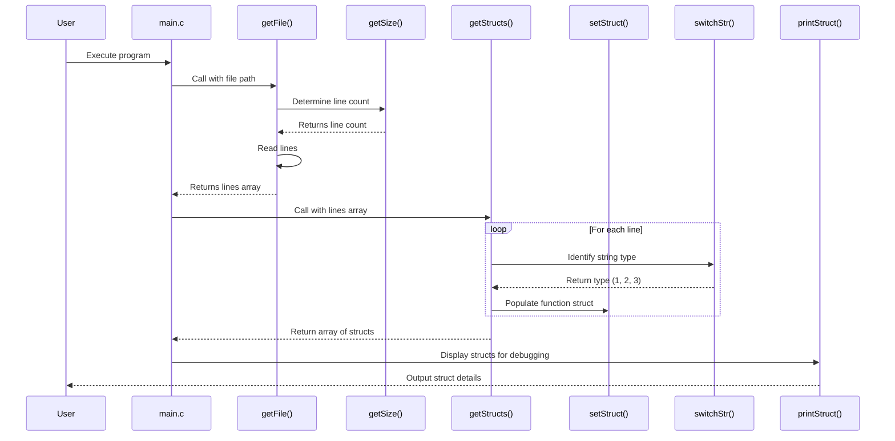

**Sequence Diagram Explanation:**

- **User starts the program execution**, which kicks off the process in `main.c`.
- **`main.c` calls `getFile()`**, passing the path of the assembly code file to be read.
- **`getFile()` invokes `getSize()`** to determine the number of lines in the file, which is crucial for memory allocation.
- **Back in `getFile()`, the file is read line by line**, based on the line count obtained from `getSize()`.
- **The lines array is returned to `main.c`** after the file has been completely read.
- **`main.c` then calls `getStructs()`,** passing it the array of lines for processing into `function` structs.
- **Within `getStructs()`, a loop processes each line.** For each line, `switchStr()` is called to identify the type of each string segment (instruction, register, or number).
- **`setStruct()` is then called** to populate a `function` struct with the relevant data extracted from the line.
- **Once all lines have been processed into `function` structs, `getStructs()` returns this array of structs to `main.c`.**
- **`main.c` may then call `printStruct()`** to display the contents of each `function` struct, primarily for debugging purposes.
- **The details of the `function` structs are output to the User,** completing the sequence of operations from file reading to data structuring.

**Flowchart Diagram:**

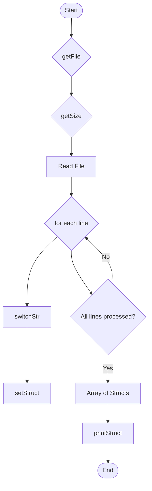

**Flowchart Explanation:**

- **Start:** The beginning of the program execution.
- **getFile:** The function is called with the file path to read the assembly code from the file.
- **getSize:** Determines the total number of lines in the file for memory allocation before reading.
- **Read File:** The actual reading of the file line by line based on the size determined.
- **for each line:** Iterates over each line read from the file for processing.
- **switchStr:** Identifies the type of each segment in the line (instruction, register, or number).
- **setStruct:** Fill a `function` struct with data extracted and identified from the line.
- **All lines processed?:** Checks if all lines from the file have been processed into structs.
    - If **No**, the process loops back to continue with the next line.
    - If **Yes**, it moves forward to the next step.
- **Array of Structs:** Once all lines are processed, an array of `function` structs is formed.
- **printStruct:** Displays the content of each `function` struct, mainly used for debugging.
- **End:** The end of the process.

### 3.1.2 - `parser.h`

This header file defines the structure and prototypes of the functions used in `parser.c`, along with any necessary data structures, constants, and standard or external library headers required for parsing assembly language code.

**Key Components:**

- **Function Declarations**:
    - `void printLines(char **lines, int size)`: Displays lines from the file.
    - `char* getLine(char **lines, int line)`: Retrieves a specific line from the array of lines.
    - `void *getFile(const char *path)`: Reads the assembly code from a file and stores each line in an array.
    - `int getSize(const char *path)`: Determines the number of lines in the file for memory allocation.
    - `void *getStructs(char **lines, int size)`: Processes each line into a `function` struct.
    - `int switchStr(char *str)`: Identifies the type of each string segment.
    - `void setStruct(struct function *f, char *instruction, char *name, char *parameter1, char *parameter2, int line)`: Assigns values to a `function` struct.
    - `void printStruct(struct function *f)`: Displays the contents of a `function` struct.

- **Data Structure Definitions**:
    - `func_t`: A structure representing a line of assembly code, including instruction, name, parameters, and line number.

**Usage:**
This header file is crucial for ensuring that `parser.c` and other components interact seamlessly with the parsing functionality. It defines a clear interface for parsing operations and the necessary structures for holding parsed data.

**Class Diagram:**

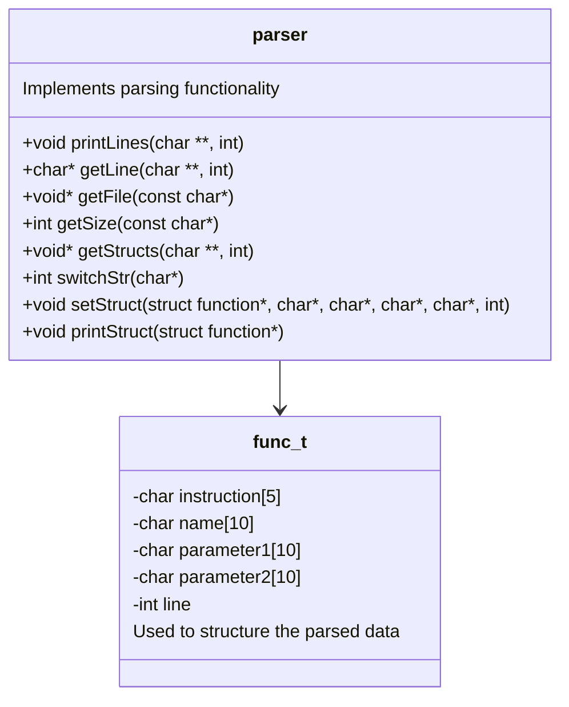

**Class Diagram Explanation:**

- The diagram shows the `func_t` class representing a structured format for a single line of assembly code, including fields for instruction, name, parameters, and line number.
- The `parser` class encapsulates the parsing functionality, with methods for handling file reading (`getFile`, `getSize`), line manipulation (`printLines`, `getLine`), structuring (`getStructs`, `setStruct`), and debugging (`printStruct`).
- The relationship between `func_t` and `parser` illustrates how parsed data is structured and managed within the parsing process.

### 3.1.3 - `tests_parser.c`

This component contains a suite of unit tests designed to verify the functionality implemented in `parser.c`. It focuses on ensuring the robustness and accuracy of the file reading, line processing, structuring, and validation processes integral to parsing assembly language code.

**Test Cases:**

- **File Data Retrieval (`getFileTEST`)**: Validates the ability to correctly read and retrieve data from an assembly code file, ensuring no data loss or corruption occurs during file reading.
- **Line Retrieval Accuracy (`getLineTEST`)**: Tests the precision of retrieving specific lines from the assembly code, verifying the correct line content is accessed, especially focusing on edge cases and boundary conditions.
- **File Size Determination (`getSizeTEST`)**: Confirms the accuracy of calculating the total number of lines in an assembly code file, which is crucial for dynamic memory allocation and data structuring.
- **Struct Processing (`getStructsTEST`)**: Assesses the process of converting raw file lines into structured `func_t` objects, checking for completeness and correctness in the representation of assembly instructions and their components.
- **String Type Identification (`switchStrTEST`)**: Evaluates the functionality that categorizes string segments into instructions, registers, or numerical values, ensuring proper handling and categorization critical for subsequent parsing phases.
- **Struct Value Assignment (`setStructTEST`)**: Examines the correctness of populating `func_t` structures with parsed data, asserting that instructions and parameters are accurately assigned.

**Usage:**
These unit tests are critical for maintaining the integrity of the parsing process. By thoroughly testing each function within `parser.c`, developers can confidently refine and extend the parser's capabilities, knowing its foundational operations are well-verified. This suite not only aids in detecting regressions but also facilitates a test-driven development approach for future enhancements.

### 3.1.4 - `tests_parser.h`

The `tests_parser.h` header file declares unit tests for `parser.c`, specifying test function prototypes that examine the parser's functionality. These tests range from file reading to data structuring, ensuring the parser operates correctly.

**Key Components:**
- `int getFileTEST()`: Checks file reading accuracy.
- `int getLineTEST()`: Ensures specific lines are correctly retrieved.
- `int getSizeTEST()`: Verifies correct file size calculation.
- `int getStructsTEST()`: Confirms lines are properly converted into structured data.
- `int switchStrTEST()`: Assesses correct identification of string types.
- `int setStructTEST()`: Tests correct struct population with data.

**Usage:**
Including `tests_parser.h` in `tests_parser.c` organizes and streamlines testing, allowing for thorough validation of the parser's functionality. It's essential for ensuring parser reliability and supports the easy addition of new tests as the parser evolves.

## 3.2 - Interpreting

### 3.2.1 - `interpreter.c`

This module is the heart of the virtual processor, interpreting and executing the parsed assembly instructions. It simulates the processor's behavior, managing the state, executing instructions, and handling system calls.

**Key Functions:**
- `initializeProcessor()`: Initializes the virtual processor, setting up registers and memory to their default states.
- `fetchInstruction()`: Retrieves the next instruction from the program based on the current value of the program counter.
- `decodeInstruction()`: Decodes an instruction to identify the operation and operands.
- `executeInstruction()`: Executes the decoded instruction, altering the processor's state as required.
- Arithmetic operations: `executeADD()`, `executeSUB()`, `executeMUL()`, `executeDIV()`.
- Logical operations: `executeAND()`, `executeOR()`, `executeXOR()`, `executeNOT()`.
- Data movement: `executeMOV()`.
- Control flow: `executeJMP()`, `executeJMP_COND()`, `executeCALL()`, `executeRET()`.
- Comparison: `executeCMP()`.
- System calls: `handleSysCall()` for operations like I/O.

**Usage:**
The interpreter is invoked after the assembly code has been parsed into a set of executable instructions. It processes each instruction sequentially, manipulating the processor's state (registers, memory) according to each instruction's semantics until the program terminates.

**Sequence Diagram:**

The following diagram shows the sequence of operations involved in the parsing process.

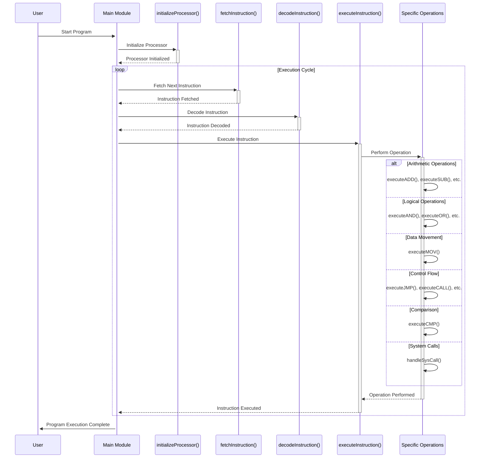

**Sequence Diagram Explanation:**

- **Start Program**: The user starts the program, initiating the execution process in the Main Module.
- **Initialize Processor**: The `initializeProcessor()` function is called to set up the virtual processor, including initializing registers and memory to their default states.
- **Execution Cycle**: A loop represents the continuous execution cycle of fetching, decoding, and executing instructions until the program terminates.
- **Fetch Next Instruction**: The `fetchInstruction()` function retrieves the next instruction based on the current value of the program counter.
- **Decode Instruction**: The `decodeInstruction()` function decodes the fetched instruction to identify the operation to be performed and its operands.
- **Execute Instruction**: The `executeInstruction()` function executes the decoded instruction, which involves calling one of the specific operation functions.
- **Perform Operation**: This step represents the execution of a specific operation based on the instruction type. It could be an arithmetic operation (like `executeADD()`, `executeSUB()`), a logical operation (`executeAND()`, `executeOR()`), data movement (`executeMOV()`), control flow (`executeJMP()`, `executeCALL()`), comparison (`executeCMP()`), or handling a system call (`handleSysCall()`).
- **Operation Performed**: After the specific operation is performed, control returns to the `executeInstruction()` function.
- **Instruction Executed**: Once the instruction is executed, the cycle repeats for the next instruction until the program completes.
- **Program Execution Complete**: Upon completion, the program exits the execution cycle, and control returns to the user.

**Flowchart Diagram:**

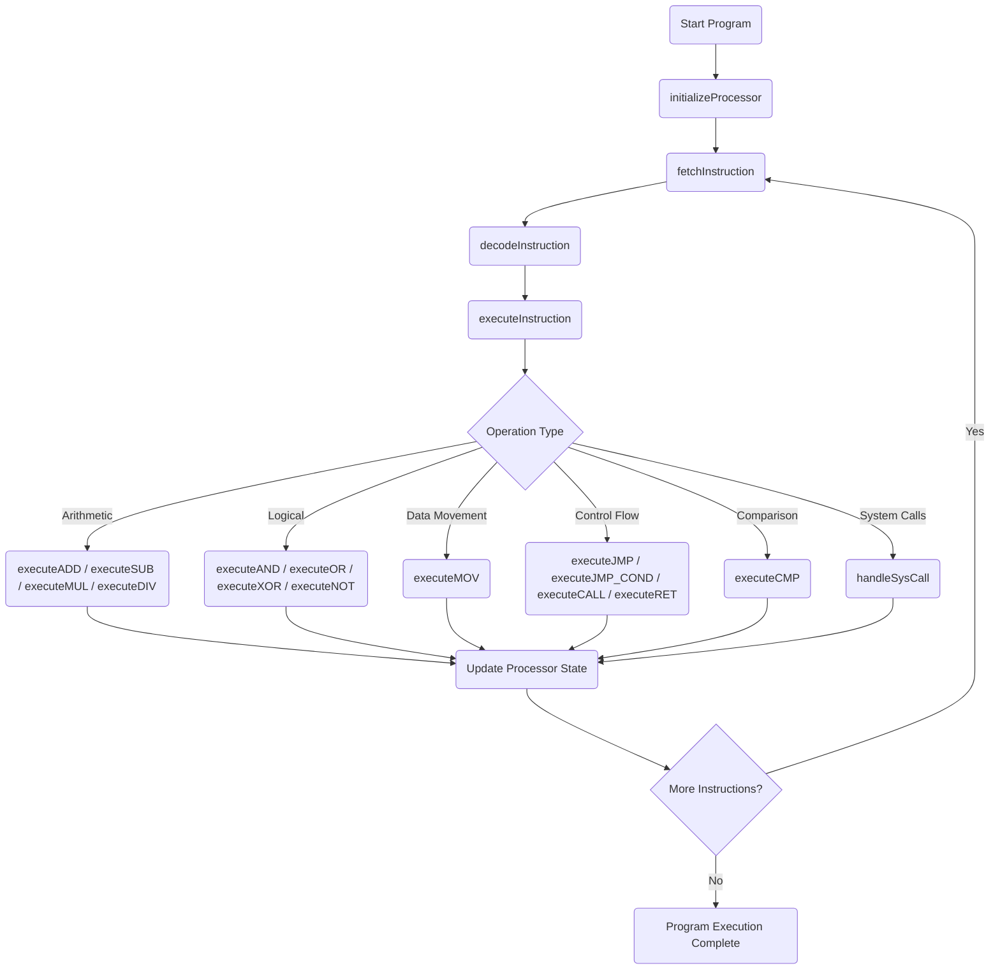

**Flowchart Explanation:**

- **Start Program**: The execution process begins.
- **initializeProcessor**: Initializes the virtual processor's registers and memory to their default states.
- **fetchInstruction**: Retrieves the next instruction based on the current program counter.
- **decodeInstruction**: Decodes the fetched instruction to identify the operation and operands.
- **executeInstruction**: Executes the decoded instruction by determining the type of operation to perform.
- **Operation Type**: A decision node determining the type of operation to execute, branching into specific operations:
    - **Arithmetic Operations**: Performs addition, subtraction, multiplication, or division.
    - **Logical Operations**: Executes logical operations like AND, OR, XOR, and NOT.
    - **Data Movement**: Moves data between registers or from register to memory and vice versa.
    - **Control Flow**: Handles jumps, conditional jumps, calls, and returns.
    - **Comparison**: Compares values and sets processor flags accordingly.
    - **System Calls**: Manages system calls for operations like input/output.
- **Update Processor State**: After executing an operation, the processor's state is updated accordingly.
- **More Instructions?**: A decision node checking if there are more instructions to execute.
    - If **Yes**, it loops back to fetch the next instruction.
    - If **No**, the program execution completes.

### 3.2.2 - `interpreter.h`

This header file outlines the structure and function prototypes used in `interpreter.c`, along with any necessary data structures, constants, and standard or external library headers required for interpreting and executing assembly language code.

**Key Components:**

- **Function Declarations**:
    - `void initializeProcessor(void)`: Sets up the virtual processor, initializing registers and memory to their default states.
    - `char* fetchInstruction(unsigned int programCounter)`: Retrieves the next instruction from the program.
    - `void decodeInstruction(char* instruction, char* operation, char** operands)`: Decodes an instruction into its operation and operands.
    - `void executeInstruction(char* operation, char** operands)`: Executes the decoded instruction, modifying the processor's state as required.
    - Arithmetic operations:
        - `void executeADD(char* operand1, char* operand2)`,
        - `void executeSUB(char* operand1, char* operand2)`,
        - `void executeMUL(char* operand1, char* operand2)`,
        - `void executeDIV(char* operand1, char* operand2)`.
    - Logical operations:
        - `void executeAND(char* operand1, char* operand2)`,
        - `void executeOR(char* operand1, char* operand2)`,
        - `void executeXOR(char* operand1, char* operand2)`,
        - `void executeNOT(char* operand)`.
    - Data movement:
        - `void executeMOV(char* destination, char* source)`.
    - Control flow operations:
        - `void executeJMP(unsigned int address)`,
        - `void executeJMP_COND(unsigned int address, char* condition)`,
        - `void executeCALL(unsigned int address)`,
        - `void executeRET(void)`.
    - Comparison:
        - `void executeCMP(char* operand1, char* operand2)`.
    - System calls:
        - `void handleSysCall(int sysCallID)` for I/O and other system interactions.

- **Data Structure Definitions**:
    - Not specified here, but typically includes definitions for the virtual processor's architecture, such as structures representing the CPU's registers, program counter, and memory layout.

**Usage:**
`interpreter.h` is essential for ensuring seamless interaction between `interpreter.c` and other components of the virtual processor application. It provides a clear interface for the interpreter's functionality, including executing assembly instructions and managing the virtual processor's state.

**Class Diagram:**

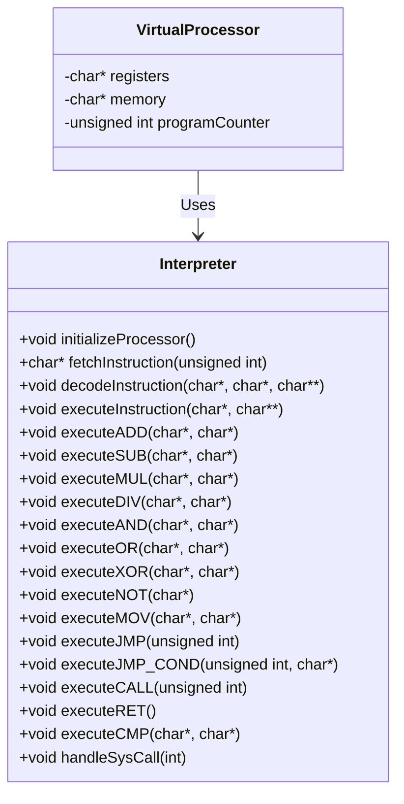

**Class Diagram Explanation:**

- The `VirtualProcessor` class represents the state of the virtual processor, including its registers, memory, and program counter, crucial for executing assembly instructions.
- The `Interpreter` class encapsulates the functionality required to interpret and execute assembly instructions on the virtual processor. It includes methods for initializing the processor, fetching, decoding, and executing instructions, and performing various operations (arithmetic, logical, data movement, control flow, and system calls).
- The relationship "Uses" indicates that the Interpreter operates on the state managed by the VirtualProcessor, manipulating it according to the semantics of each assembly instruction executed.

### 3.2.3 - `tests_interpreter.c`

This component hosts a comprehensive suite of unit tests dedicated to validating the functionality implemented in `interpreter.c`. These tests are meticulously designed to ascertain the interpreter's precision in executing assembly instructions and managing the virtual processor's state, thereby ensuring the integrity and reliability of the virtual processor's core operations.

**Test Cases:**

- **Processor Initialization (`initializeProcessorTEST`)**: Confirms that the virtual processor is correctly initialized, with all registers and memory set to their default states, ensuring a clean starting point for program execution.
- **Instruction Fetch Accuracy (`fetchInstructionTEST`)**: Verifies the ability to accurately fetch the next instruction based on the current value of the program counter, crucial for sequential execution.
- **Instruction Decode Correctness (`decodeInstructionTEST`)**: Tests the precision of the instruction decoding process, ensuring that operations and operands are correctly identified from the instruction code.
- **Instruction Execution Validation (`executeInstructionTEST`)**: Examines the execution of instructions, confirming that the processor's state is correctly altered according to the semantics of each instruction.
    - Arithmetic Operations: `executeADDTEST`, `executeSUBTEST`, `executeMULTEST`, `executeDIVTEST`.
    - Logical Operations: `executeANDTEST`, `executeORTEST`, `executeXORTEST`, `executeNOTTEST`.
    - Data Movement: `executeMOVTEST`.
    - Control Flow: `executeJMPTEST`, `executeJMP_CONDTEST`, `executeCALLTEST`, `executeRETTEST`.
    - Comparison: `executeCMPTEST`.
- **System Call Handling (`handleSysCallTEST`)**: Ensures that system calls are correctly managed, facilitating operations like I/O as per the virtual processor's specification.
- **Error Handling (`errorHandlingTEST`)**: Validates the interpreter's ability to gracefully handle errors encountered during instruction execution, such as invalid instructions or memory access violations.

**Usage:**
These unit tests play an indispensable role in safeguarding the functionality of the interpreter. By rigorously testing each component within `interpreter.c`, developers are empowered to enhance the interpreter's capabilities with the assurance of its foundational correctness. This not only aids in identifying regressions early but also advocates for a test-driven development methodology for introducing new features or optimizations.

### 3.2.4 - `tests_interpreter.h`

The `tests_interpreter.h` header file articulates the declarations of unit tests for `interpreter.c`, outlining the prototypes for functions that scrutinize the interpreter's execution of assembly instructions and management of the virtual processor's state.

**Key Components:**
- `int initializeProcessorTEST()`: Evaluates the initialization process of the virtual processor.
- `int fetchInstructionTEST()`: Confirms the accuracy of instruction fetching.
- `int decodeInstructionTEST()`: Tests the correctness of the instruction decoding mechanism.
- `int executeInstructionTEST()`: Assesses the execution of instructions and the consequent modifications to the processor's state.
- Arithmetic Operations Tests: `int executeADDTEST()`, `int executeSUBTEST()`, etc.
- Logical Operations Tests: `int executeANDTEST()`, `int executeORTEST()`, etc.
- Data Movement Test: `int executeMOVTEST()`.
- Control Flow Tests: `int executeJMPTEST()`, `int executeCALLTEST()`, etc.
- Comparison Test: `int executeCMPTEST()`.
- System Call Handling Test: `int handleSysCallTEST()`.
- Error Handling Test: `int errorHandlingTEST()`.

**Usage:**
Incorporating `tests_interpreter.h` into `tests_interpreter.c` facilitates a structured and methodical approach to testing, ensuring comprehensive verification of the interpreter's functionality. It is pivotal for maintaining the reliability of the interpreter and supports the iterative enhancement of the virtual processor by laying a robust foundation for test-driven development.

## 3.3 - Main

### 3.3.1 - `main.c`

This component acts as the entry point for the virtual processor program, coordinating the parsing of assembly code, initializing the interpreter, and managing the execution of the parsed instructions.

**Key Features:**
- `main(int argc, char* argv[])`: Parses command-line arguments to read assembly file paths and initiates the execution process.
- `loadAssemblyCode(const char* filePath)`: Opens and reads the specified assembly code file, preparing it for parsing.
- `parseCode(char* assemblyCode)`: Utilizes the parser to convert raw assembly code into a format that can be executed by the interpreter.
- `initializeInterpreter()`: Sets up the interpreter, including initializing the virtual processor's state.
- `executeProgram()`: Runs the parsed assembly program, managing instruction execution in sequence.
- `displayFinalState()`: Outputs the final state of the virtual processor, including the values of registers and any relevant memory content.

**Usage:**
`main.c` orchestrates the overall process of executing an assembly language program on the virtual processor. It integrates the parser and interpreter modules, handling file input, execution, and outputting the execution results.

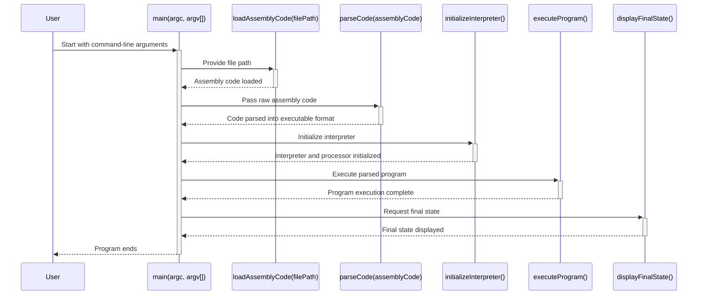

**Sequence Diagram Explanation:**

- **Start with command-line arguments**: The user initiates the program execution by running `main.c`, passing any necessary command-line arguments, typically including the path to the assembly code file to be executed.
- **Provide file path**: The `main` function calls `loadAssemblyCode`, providing the file path obtained from the command-line arguments.
- **Assembly code loaded**: The `loadAssemblyCode` function opens the specified file, reads its contents into memory, and returns the raw assembly code to the `main` function.
- **Pass raw assembly code**: The `main` function then passes this raw assembly code to `parseCode` for parsing.
- **Code parsed into executable format**: The `parseCode` function analyzes the raw assembly code, converting it into a structured format that can be interpreted, such as a series of instruction objects or tokens.
- **Initialize interpreter**: With the code parsed, `main` invokes `initializeInterpreter` to set up the interpreter, including initializing the virtual processor's state (registers, memory, etc.).
- **Execute parsed program**: Once initialization is complete, `main` calls `executeProgram` to run the parsed assembly program. This function manages the sequential execution of instructions.
- **Program execution complete**: After executing all instructions, control returns to `main`, indicating the program has finished running.
- **Request final state**: Finally, `main` calls `displayFinalState` to output the final state of the virtual processor, such as the values of registers and any relevant portions of memory.
- **Final state displayed**: The final state of the processor is displayed to the user, marking the end of the program's execution.

### 3.3.2 - `main.h`

This header file establishes the interface for the `main` module, outlining the structure and prototypes of functions utilized in `main.c`, along with any essential data structures, constants, and dependencies necessary for the execution flow of the virtual processor application.

**Key Components:**

- **Function Declarations**:
    - `int main(int argc, char* argv[])`: Entry point of the program, handling command-line arguments.
    - `void loadAssemblyCode(const char* filePath)`: Reads assembly code from the specified file path into memory.
    - `void parseCode(const char* assemblyCode)`: Transforms raw assembly code into a structured format for execution.
    - `void initializeInterpreter()`: Prepares the interpreter by initializing the virtual processor's state.
    - `void executeProgram()`: Executes the structured assembly code, simulating the program run.
    - `void displayFinalState()`: Outputs the final state of the virtual processor after execution.

- **Data Structure Definitions**:
    - Not explicitly defined here but implies the use of structures for managing the execution state, such as processor registers and memory layout.

**Usage:**
`main.h` serves as a crucial link between `main.c` and the rest of the virtual processor components, facilitating a smooth execution process. It ensures that the functionalities within the `main` module are correctly exposed and accessible to other parts of the application, thereby supporting a cohesive and modular architecture.

**Class Diagram:**

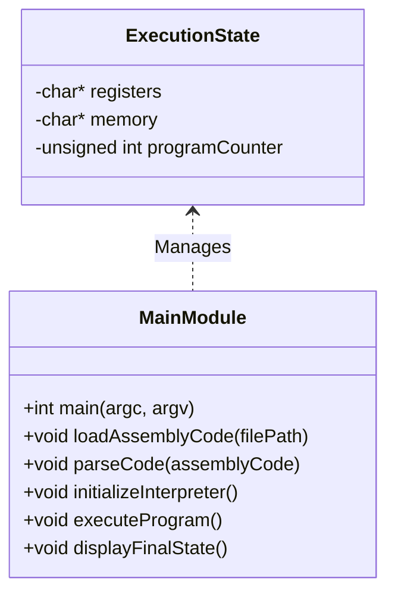

**Class Diagram Explanation:**

- The `ExecutionState` class symbolizes the virtual processor's operational state, encapsulating elements like registers, memory, and the program counter essential for running assembly code.
- The `MainModule` class embodies the core functionalities of the main application process, from initializing and parsing assembly code to executing it and displaying the processor's final state.
- The "Manages" relationship indicates that the `MainModule` oversees the modification and observation of the `ExecutionState`, reflecting the changes induced by the execution of assembly code and enabling the visualization of execution outcomes.

#### 3.3.3 - `tests_main.c`

This component houses a comprehensive suite of integration tests for the `main` module, aimed at validating the seamless operation of the entire virtual processor system from the initial parsing of assembly language code through to its execution.

**Test Cases:**

- **Full Program Execution (`executeFullProgramTest`)**: Confirms the system's capability to accurately execute an entire assembly language program, ensuring the outputs and final processor state match expected results.
- **Syntax and Instruction Error Detection (`syntaxAndInstructionErrorTest`)**: Tests the system's ability to identify and handle syntax errors or invalid instructions, ensuring robust error management.
- **Integration with Parser and Interpreter (`parserInterpreterIntegrationTest`)**: Verifies the effective integration and interaction between the `main` module, parser, and interpreter, ensuring instructions are correctly processed and executed.

**Usage:**
These integration tests are vital for ensuring the correct functioning of the virtual processor application as a unified entity. They scrutinize the interplay between different components—namely the parser, interpreter, and `main` module—to detect any discrepancies or failures, thereby facilitating a comprehensive quality assurance process.

### 3.3.4 - `tests_main.h`

This header file delineates the structure for integration testing of the `main` module, outlining prototypes for testing functions that scrutinize the application's execution flow. It is designed to ensure that the virtual processor executes assembly code as intended, from parsing through to execution.

**Key Components:**
- Prototypes for integration tests outlined in `tests_main.c`, designed to assess various aspects of the `main` module's functionality and its interactions within the virtual processor system.
- Any necessary preliminary definitions or setup required for executing the tests, ensuring a controlled and consistent testing environment.

**Usage:**
`tests_main.h` organizes the integration tests for the `main` module, enabling systematic verification of its operational integrity within the context of the virtual processor application. It is instrumental in maintaining the reliability of the application and supporting ongoing development and refinement.

### 3.4 - Overall Flow

The following diagrams illustrate the overall flow of the virtual processor application, encompassing the parsing and interpreting processes, as well as the main module's orchestration of the entire execution.

#### 3.4.1 - Sequence Diagram

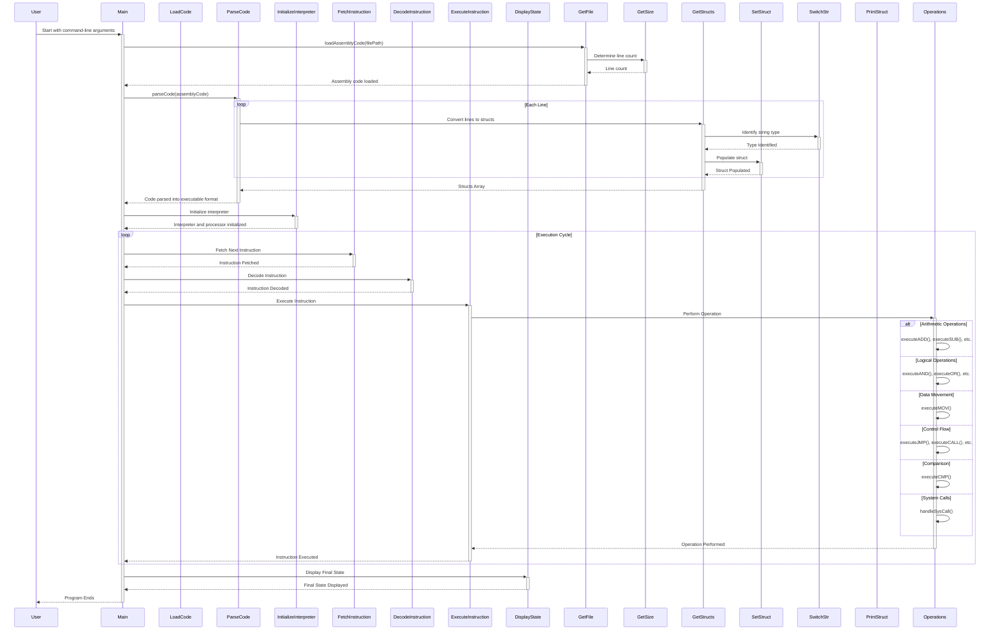

#### 3.4.2 - Flowchart Diagram

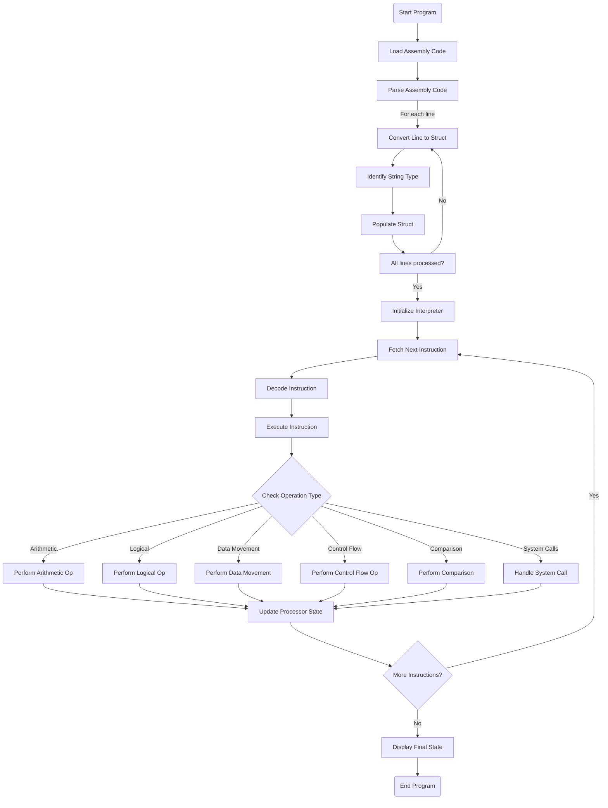

#### 3.4.2 - Class Diagram

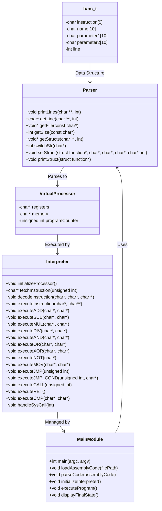

---

# 4 - End Matter

## 4.1 - Contributors

[*(Back to top)*](#toc)

|                                             Photos                                             |          Name          |                                                                     GitHub                                                                     |                                                                                 LinkedIn                                                                                 |
| :--------------------------------------------------------------------------------------------: | :--------------------: | :--------------------------------------------------------------------------------------------------------------------------------------------: | :----------------------------------------------------------------------------------------------------------------------------------------------------------------------: |
|   | **Laura-Lee HOLLANDE** | [](https://github.com/lauraleehollande) | [](https://www.linkedin.com/in/laura-lee-hollande-278345198/) |
|  |    **Ian LAURENT**     |          [](https://github.com/Ianlaur)          |            [](https://www.linkedin.com/in/ian-h-laurent/)             |
|   |    **Pierre GORIN**    |       [](https://github.com/Pierre2103)       |       [](https://www.linkedin.com/in/pierre-gorin-61a784221/)        |
|   |  **Laurent BOUQUIN**   |   [](https://github.com/laurentbouquin)   |            [](https://www.linkedin.com/in/laurentb22/)            |
|  |    **Evan UHRING**     |     [](https://github.com/Evan-UHRING)      |        [](https://www.linkedin.com/in/evan-uhring-72911b293/)         |
|   |    **Victor LEROY**    |    [](https://github.com/Victor-Leroy)     |       [](https://www.linkedin.com/in/victor-leroy-64baa3229/)        |
|  |   **Manech LAGUENS**   |  [](https://github.com/Manech-Laguens)   |     [](https://www.linkedin.com/in/manech-laguens-020127293/)      |

## 4.2 - Related Documents

[*(Back to top)*](#toc)

|                        Document                         |                              Description                              |
| :-----------------------------------------------------: | :-------------------------------------------------------------------: |
| [Functional Specification](Functional-Specification.md) | This document describes the functional specifications of the project. |
|                [Test Plan](Test-Plan.md)                |         This document describes the test plan of the project.         |
|                 [Readme](../README.md)                  |                 This document describes the project.                  |

## 4.3 - License

[*(Back to top)*](#toc)

This project is licensed under the MIT License - see the [LICENSE](../LICENSE) file for details.

## 4.4 - References

[*(Back to top)*](#toc)

In this section, you will find all the tools and references used to create this document.

### 4.4.1 - Tools
- [Mermaid Live Editor](https://mermaid-js.github.io/mermaid-live-editor/)
- [Shield.io](https://shields.io/)

### 4.4.2 - References
- [Markdown Guide](https://www.markdownguide.org/cheat-sheet/)
- [Practical Guide to Writing Technical Specs](https://stackoverflow.blog/2020/04/06/a-practical-guide-to-writing-technical-specs/)
- [Wikipedia Interpreter](https://en.wikipedia.org/wiki/Interpreter_(computing))
- [Codewars - Assembly Interpreter Part I](https://www.codewars.com/kata/58e24788e24ddee28e000053/)
- [Codewars - Assembly Interpreter Part II](https://www.codewars.com/kata/58e61f3d8ff24f774400002c)
- [C Good Practices](https://github.com/mcinglis/c-style)
- [Naming Conventions](https://en.wikipedia.org/wiki/Naming_convention_(programming))

## 4.5 - Glossary

[*(Back to top)*](#toc)

|             Term              |                                                                                                                     Definition                                                                                                                      |                                                                                    What it means in this project                                                                                    |                              Additional Content                               |
| :---------------------------: | :-------------------------------------------------------------------------------------------------------------------------------------------------------------------------------------------------------------------------------------------------: | :-------------------------------------------------------------------------------------------------------------------------------------------------------------------------------------------------: | :---------------------------------------------------------------------------: |
|       **Processor[^1]**       |                                                                   A processor is the logic circuitry that responds to and processes the basic instructions that drive a computer.                                                                   |                                                             The processor is the virtual processor that will execute the assembly code.                                                             |      [Wikipedia](https://en.wikipedia.org/wiki/Central_processing_unit)       |
|      **Interpreter[^2]**      |       In computer science, an interpreter is a computer program that directly executes instructions written in a programming or scripting language, without requiring them previously to have been compiled into a machine language program.        |                                                            The interpreter is the virtual processor that will execute the assembly code.                                                            |      [Wikipedia](https://en.wikipedia.org/wiki/Interpreter_(computing))       |
|   **Assembly Language[^3]**   | An assembly language is a low-level programming language for a computer, or other programmable device, in which there is a very strong (generally one-to-one) correspondence between the language and the architecture's machine code instructions. |                                                      The assembly language is the language that will be interpreted by the virtual processor.                                                       |         [Wikipedia](https://en.wikipedia.org/wiki/Assembly_language)          |
|           **C[^4]**           |                                        C is a general-purpose, procedural computer programming language supporting structured programming, lexical variable scope, and recursion, with a static type system.                                        |                                                                       C is the language used to write the virtual processor.                                                                        |      [Wikipedia](https://en.wikipedia.org/wiki/C_(programming_language))      |
|  **Low-Level Language[^5]**   |                                                  A low-level programming language is a programming language that provides little or no abstraction from a computer's instruction set architecture.                                                  |                                                                           The assembly language is a low-level language.                                                                            |   [Wikipedia](https://en.wikipedia.org/wiki/Low-level_programming_language)   |
|       **Emulation[^6]**       |                                                   In computing, emulation refers to the ability of a computer program in an electronic device to emulate (or imitate) another program or device.                                                    |                                                                           The virtual processor will emulate a processor.                                                                           |              [Wikipedia](https://en.wikipedia.org/wiki/Emulator)              |
|      **Instruction[^7]**      |                                                                                   An instruction is an order given to a computer processor by a computer program.                                                                                   |                                                                         The assembly language is composed of instructions.                                                                          |   [Wikipedia](https://en.wikipedia.org/wiki/Instruction_(computer_science))   |
|   **Operating System[^8]**    |                                                   An operating system is system software that manages computer hardware, software resources, and provides common services for computer programs.                                                    |                                                              The operating system is the software that will run the virtual processor.                                                              |          [Wikipedia](https://en.wikipedia.org/wiki/Operating_system)          |
|  **Visual Studio Code[^9]**   |                                                                           Visual Studio Code is a free source-code editor made by Microsoft for Windows, Linux and macOS.                                                                           |                                                               Visual Studio Code is the IDE[^10] used to write the virtual processor.                                                               |         [Wikipedia](https://en.wikipedia.org/wiki/Visual_Studio_Code)         |
|         **IDE[^10]**          |                                           An integrated development environment (IDE) is a software application that provides comprehensive facilities to computer programmers for software development.                                            |                                                                 Visual Studio Code is the IDE used to write the virtual processor.                                                                  | [Wikipedia](https://en.wikipedia.org/wiki/Integrated_development_environment) |
|         **GCC[^11]**          |                                                  GCC, formerly an acronym for GNU Compiler Collection, is a compiler system produced by the GNU Project supporting various programming languages.                                                   |                                                                     GCC is the compiler used to compile the virtual processor.                                                                      |      [Wikipedia](https://en.wikipedia.org/wiki/GNU_Compiler_Collection)       |
|       **Compiler[^12]**       |                                        A compiler is a computer program that translates computer code written in one programming language (the source language) into another language (the target language).                                        |                                                                     GCC is the compiler used to compile the virtual processor.                                                                      |              [Wikipedia](https://en.wikipedia.org/wiki/Compiler)              |
| **Performance Analysis[^13]** |                                   Performance analysis is the process of assessing the performance of a computer, comparing the performance of one or more systems, or evaluating the performance of a component.                                   |                                                     Performance analysis is the process of assessing the performance of the virtual processor.                                                      |  [Wikipedia](https://en.wikipedia.org/wiki/Profiling_(computer_programming))  |
|  **Memory Management[^14]**   |                               Memory management is the process of controlling and coordinating computer memory, assigning portions called blocks to various running programs to optimize overall system performance.                                |       Memory management is the process of controlling and coordinating computer memory, assigning portions called blocks to various running programs to optimize overall system performance.        |         [Wikipedia](https://en.wikipedia.org/wiki/Memory_management)          |
|         **RAM[^15]**          |                                              Random-access memory (RAM) is a form of computer memory that can be read and changed in any order, typically used to store working data and machine code.                                              |                                                                          RAM is the memory used by the virtual processor.                                                                           |        [Wikipedia](https://en.wikipedia.org/wiki/Random-access_memory)        |
|  **Naming Convention[^16]**   |                         A naming convention is a set of rules for choosing the character sequence to be used for identifiers which denote variables, types, functions, and other entities in source code and documentation.                         | A naming convention is a set of rules for choosing the character sequence to be used for identifiers which denote variables, types, functions, and other entities in source code and documentation. |  [Wikipedia](https://en.wikipedia.org/wiki/Naming_convention_(programming))   |
|       **Register[^17]**       |                                                      In computer architecture, a processor register is a quickly accessible location available to a computer's central processing unit (CPU).                                                       |                                                                     Registers are used by the virtual processor to store data.                                                                      |         [Wikipedia](https://en.wikipedia.org/wiki/Processor_register)         |
|         **Jump[^18]**         |                                                           In computer science, a jump statement is a statement that unconditionally transfers program control to a designated statement.                                                            |                                                         Jump statements are used by the virtual processor to change the flow of execution.                                                          |     [Wikipedia](https://en.wikipedia.org/wiki/Branch_(computer_science))      |
|       **Parsing[^19]**        |                  Parsing, syntax analysis, or syntactic analysis is the process of analyzing a string of symbols, either in natural language, computer languages or data structures, conforming to the rules of a formal grammar.                   |                                                                   Parsing is the process of analyzing the assembly language code.                                                                   |              [Wikipedia](https://en.wikipedia.org/wiki/Parsing)               |
|       **Operand[^20]**        |                                                    In mathematics and computer programming, an operand is the object of a mathematical operation, a quantity on which an operation is performed.                                                    |                                                            Operands are used by the virtual processor to perform arithmetic operations.                                                             |              [Wikipedia](https://en.wikipedia.org/wiki/Operand)               |

## 4.6 - Footnotes

[*(Back to top)*](#toc)

[^1]: [Wikipedia - Processor](https://en.wikipedia.org/wiki/Central_processing_unit)
[^2]: [Wikipedia - Interpreter](https://en.wikipedia.org/wiki/Interpreter_(computing))
[^3]: [Wikipedia - Assembly Language](https://en.wikipedia.org/wiki/Assembly_language)
[^4]: [Wikipedia - C](https://en.wikipedia.org/wiki/C_(programming_language))
[^5]: [Wikipedia - Low-Level Language](https://en.wikipedia.org/wiki/Low-level_programming_language)
[^6]: [Wikipedia - Emulation](https://en.wikipedia.org/wiki/Emulator)
[^7]: [Wikipedia - Instruction](https://en.wikipedia.org/wiki/Instruction_(computer_science))
[^8]: [Wikipedia - Operating System](https://en.wikipedia.org/wiki/Operating_system)
[^9]: [Wikipedia - Visual Studio Code](https://en.wikipedia.org/wiki/Visual_Studio_Code)
[^10]: [Wikipedia - IDE](https://en.wikipedia.org/wiki/Integrated_development_environment)
[^11]: [Wikipedia - GCC](https://en.wikipedia.org/wiki/GNU_Compiler_Collection)
[^12]: [Wikipedia - Compiler](https://en.wikipedia.org/wiki/Compiler)
[^13]: [Wikipedia - Performance Analysis](https://en.wikipedia.org/wiki/Profiling_(computer_programming))
[^14]: [Wikipedia - Memory Management](https://en.wikipedia.org/wiki/Memory_management)
[^15]: [Wikipedia - RAM](https://en.wikipedia.org/wiki/Random-access_memory)
[^16]: [Wikipedia - Naming Convention](https://en.wikipedia.org/wiki/Naming_convention_(programming))
[^17]: [Wikipedia - Register](https://en.wikipedia.org/wiki/Processor_register)
[^18]: [Wikipedia - Jump](https://en.wikipedia.org/wiki/Branch_(computer_science))
[^19]: [Wikipedia - Parsing](https://en.wikipedia.org/wiki/Parsing)
[^20]: [Wikipedia - Operand](https://en.wikipedia.org/wiki/Operand)
