<div align="center">

# Technical Specification

---
**Title:** Virtual Processor Project - Team 8

**Author:** Pierre GORIN

**Team:** Team 8

**Reviewer(s):** Laurent BOUQUIN, Evan UHRING

**Created on:** January 22<sup>nd</sup>, 2024

**Last updated:** January 29<sup>th</sup>, 2024

---

### Approvals

| Reviewer           | Role              | Approved | Date |
| ------------------ | ----------------- | -------- | ---- |
| Laurent BOUQUIN    | Quality Assurance |          |      |
| Evan UHRING        | Quality Assurance |          |      |
| Laura-Lee HOLLANDE | Project Manager   |          |      |
| Ian LAURENT        | Program Manager   |          |      |
| Pierre GORIN       | Technical Lead    |          |      |
| Manech LAGUENS     | Software Engineer |          |      |
| Victor LEROY       | Software Engineer |          |      |

</div>

<br><details>
<summary><h3 id="toc"> Table of Contents <i>(Click to expand)</i></h3></summary>

- [Technical Specification](#technical-specification)
    - [Approvals](#approvals)
- [1 - Overview](#1---overview)
  - [1.1 - Purpose](#11---purpose)
    - [1.1.1 - Goals](#111---goals)
    - [1.1.2 - Objectives](#112---objectives)
    - [1.1.3 - Success Criteria](#113---success-criteria)
  - [1.2 - Stakeholders](#12---stakeholders)
    - [1.2.1 - Project Team](#121---project-team)
    - [1.2.2 - Client](#122---client)
  - [1.3 - Usage](#13---usage)
    - [1.3.1 - Requirements](#131---requirements)
    - [1.3.2 - Installation](#132---installation)
      - [1.3.2.1 - Installation with Bash](#1321---installation-with-bash)
      - [1.3.2.2 - Installation with Github Desktop](#1322---installation-with-github-desktop)
    - [1.3.3 - Running](#133---running)
  - [1.4 - Scope](#14---scope)
    - [1.4.1 - In Scope](#141---in-scope)
    - [1.4.2 - Out of Scope](#142---out-of-scope)
- [2 - Overall Description](#2---overall-description)
  - [2.1 System Environment](#21-system-environment)
    - [2.1.1 - Hardware](#211---hardware)
    - [2.1.2 - Software](#212---software)
  - [2.2 - Project Folder Structure](#22---project-folder-structure)
  - [2.3 - Conventions](#23---conventions)
    - [2.3.1 - Naming Conventions](#231---naming-conventions)
      - [2.3.1.1 Folders](#2311-folders)
      - [2.3.1.2 Files](#2312-files)
      - [2.3.1.3 Variables](#2313-variables)
      - [2.3.1.4 Constants](#2314-constants)
      - [2.3.1.5 Functions](#2315-functions)
    - [2.3.2 - Formatting Conventions](#232---formatting-conventions)
      - [2.3.2.1 - Indentation](#2321---indentation)
      - [2.3.2.2 - Line Length](#2322---line-length)
      - [2.3.2.3 - Line Breaks](#2323---line-breaks)
      - [2.3.2.4 - Comments](#2324---comments)
  - [2.4 - Assembly Syntax](#24---assembly-syntax)
    - [2.4.1 - Registers](#241---registers)
      - [2.4.1.1 - Storing an immediate value into a register](#2411---storing-an-immediate-value-into-a-register)
      - [2.4.1.2 Copying the value of a register into another register](#2412-copying-the-value-of-a-register-into-another-register)
      - [2.4.1.3 Reading the value from the memory to a register](#2413-reading-the-value-from-the-memory-to-a-register)
      - [2.4.1.4 Writing the value from a register to the memory](#2414-writing-the-value-from-a-register-to-the-memory)
    - [2.4.2 - Jumping to a label](#242---jumping-to-a-label)
      - [2.4.2.1 - Jumping unconditionally](#2421---jumping-unconditionally)
      - [2.4.2.2 - Jumping conditionally (where "cc" is a condition code)](#2422---jumping-conditionally-where-cc-is-a-condition-code)
    - [2.4.3 - Comparing registers](#243---comparing-registers)
    - [2.4.4 - Calling a subroutine](#244---calling-a-subroutine)
    - [2.4.5 - Returning from a subroutine](#245---returning-from-a-subroutine)
    - [2.4.6 - Arithmetic operations](#246---arithmetic-operations)
      - [2.4.6.1 - Addition](#2461---addition)
      - [2.4.6.2 - Subtraction](#2462---subtraction)
      - [2.4.6.3 - Multiplication](#2463---multiplication)
      - [2.4.6.4 - Division](#2464---division)
    - [2.4.7 - Logical operations](#247---logical-operations)
      - [2.4.7.1 - Logical AND](#2471---logical-and)
      - [2.4.7.2 - Logical OR](#2472---logical-or)
      - [2.4.7.3 - Logical XOR](#2473---logical-xor)
      - [2.4.7.3 - Logical NOT](#2473---logical-not)
      - [2.4.8 - Comments](#248---comments)
- [3 - Software Architecture](#3---software-architecture)
  - [3.1 - Scraping](#31---scraping)
    - [3.1.1 - `scraper.c`](#311---scraperc)
    - [3.1.2 - `scraper.h`](#312---scraperh)
    - [3.1.3 - `scraper_test.c`](#313---scraper_testc)
    - [3.1.4 - `scraper_test.h`](#314---scraper_testh)
  - [3.2 Parsing](#32-parsing)
    - [3.2.1 `parser.c`](#321-parserc)
    - [3.2.2 `parser.h`](#322-parserh)
    - [3.2.3 `parser_test.c`](#323-parser_testc)
    - [3.2.4 `parser_test.h`](#324-parser_testh)
  - [3.3 Interpreting](#33-interpreting)
    - [3.3.1 `interpreter.c`](#331-interpreterc)
    - [3.3.2 `interpreter.h`](#332-interpreterh)
    - [3.3.3 `interpreter_test.c`](#333-interpreter_testc)
    - [3.3.4 `interpreter_test.h`](#334-interpreter_testh)
  - [3.4 Main](#34-main)
    - [3.4.1 `main.c`](#341-mainc)
    - [3.4.2 `main.h`](#342-mainh)
    - [3.4.3 `main_test.c`](#343-main_testc)
    - [3.4.4 `main_test.h`](#344-main_testh)

</details>

---

# 1 - Overview

## 1.1 - Purpose

[*(Back to top)*](#toc)

### 1.1.1 - Goals

This project aims to develop a virtual processor[^1] and an interpreter[^2] for a custom assembly language[^3]. Using only standard C[^4] libraries for wide compatibility, the primary goal is to design a minimal assembly language and build a C program interpreter capable of executing and error-checking assembly code. This solution is intended to serve educational purposes and software developers interested in low-level programming[^5] and processor emulation. The project combines technical innovation with practical application, focusing on creating a user-friendly and educational tool in the field of computer architecture.

### 1.1.2 - Objectives

The project objectives are as follows:

- Design a minimal assembly language with a sufficient set of instructions.
- Develop an interpreter capable of executing assembly code.
- Develop an interpreter capable of error-checking assembly code.
- Make the interpreter user-friendly and easy to use.
- Make the interpreter compatible with a wide range of operating systems.

### 1.1.3 - Success Criteria

The project will be considered successful if the following criteria are met:

- The interpreter is capable of executing assembly code.
- The interpreter is compatible with the most common operating systems.
- 50% of the set of instructions are implemented.

## 1.2 - Stakeholders

[*(Back to top)*](#toc)

This project is for educational purposes and is not intended for commercial use. The project team will be responsible for the development of the project and the client will be responsible for providing feedback and guidance throughout the development process.

### 1.2.1 - Project Team

| Name               | Role              | Github                                                    |
| ------------------ | ----------------- | --------------------------------------------------------- |
| Laura-Lee HOLLANDE | Project Manager   | [Laura-Lee's Github](https://github.com/lauraleehollande) |
| Ian LAURENT        | Program Manager   | [Ian's Github](https://github.com/Ianlaur)                |
| Pierre GORIN       | Technical Lead    | [Pierre's Github](Pierre2103)                             |
| Victor LEROY       | Software Engineer | [Victor's Github](https://github.com/Victor-Leroy)        |
| Manech LAGUENS     | Software Engineer | [Manech's Github](https://github.com/Manech-Laguens)      |
| Laurent BOUQUIN    | Quality Assurance | [Laurent's Github](https://github.com/Ianlaur)            |
| Evan UHRING        | Quality Assurance | [Evan's Github](https://github.com/Evan-UHRING)           |

### 1.2.2 - Client

| Name             | Role                 | Contact                                                         |
| ---------------- | -------------------- | --------------------------------------------------------------- |
| ALGOSUP          | Client               | [Website](https://www.algosup.com/)                             |
| Franck JEANNIN   | ALGOSUP's Co-Founder | [LinkedIn](https://www.linkedin.com/in/franck-jeannin/)         |
| Eric LARCHEVEQUE | ALGOSUP's Co-Founder | [LinkedIn](https://www.linkedin.com/in/ericlarch/)              |
| Natacha BOEZ     | ALGOSUP's Co-Founder | [LinkedIn](https://www.linkedin.com/in/natacha-boez-913a33167/) |

## 1.3 - Usage

[*(Back to top)*](#toc)

The interpreter is designed to be user-friendly and easy to use. The interpreter will be compatible with the most common operating systems and will be capable of executing assembly code and error-checking assembly code. The interpreter will be capable of displaying the output of the assembly code.
Following are the instructions to install and run the interpreter.

### 1.3.1 - Requirements

To run your custom assembly code, you will need to install the following dependencies:

- [VS Code](https://code.visualstudio.com/download) - Visual Studio Code is a free source-code editor made by Microsoft for Windows, Linux and macOS.
- [C/C++ for Visual Studio Code](https://marketplace.visualstudio.com/items?itemName=ms-vscode.cpptools) - C/C++ for Visual Studio Code is an extension for VS Code that provides IntelliSense, debugging, and code browsing support for C and C++ code.
- [GCC](https://gcc.gnu.org/install/) - GCC, the GNU Compiler Collection, is a free collection of compilers for C, C++, Objective-C, Fortran, Ada, Go, and D programming languages.

The software is developed using the 23<sup>rd</sup> version of the C language.

### 1.3.2 - Installation

To install the interpreter, you will need to follow these steps:

1. Clone the repository on your local machine, or download the repository as a ZIP file and extract it.

#### 1.3.2.1 - Installation with Bash

Open a terminal and run the following commands:

If you are on macOS:

```bash
git clone https://github.com/algosup/2023-2024-project-3-virtual-processor-team-8.git
cd 2023-2024-project-3-virtual-processor-team-8
```

#### 1.3.2.2 - Installation with Github Desktop

Open Github Desktop and click on `File > Clone Repository`. Select the URL tab and enter the following URL:

```bash
https://github.com/algosup/2023-2024-project-3-virtual-processor-team-8.git
```

Then click on `Clone` and click on `Repository > Open in Visual Studio Code`.

### 1.3.3 - Running

To run the interpreter, you will need to follow these steps:

1. Open the repository in VS Code.
2. Navigate to the `src` folder.
3. Modify the `code.asm` file to include your custom assembly code.
4. Open the terminal in VS Code.
<!-- TODO: Add the command(s) to run the assembly -->

## 1.4 - Scope

[*(Back to top)*](#toc)

### 1.4.1 - In Scope

The project will include the following features:

- Basic assembly language with a minimal set of instructions.
- Interpreter capable of executing assembly code.
- Interpreter capable of error-checking assembly code.
- User-friendly interface.
- Compatibility with the most common operating systems.

### 1.4.2 - Out of Scope

The project will not include the following features:

- Advanced assembly language with a complex set of instructions.
- Graphical user interface.
- Debugging tools.
- Compatibility with specific hardware configurations.
- Compatibility with other programming languages.
- Real-time performance analysis.
- Advanced memory management.

# 2 - Overall Description

## 2.1 System Environment

[*(Back to top)*](#toc)

### 2.1.1 - Hardware

The interpreter will be compatible with the most common hardware configurations, and will be tested on the following hardware:

| Specification    | Lenovo ThinkBook 14 G2 | Lenovo ThinkPad 2023 | Apple MacBook Air M1 2020 | Apple MacBook Pro M1 2020 |
| ---------------- | ---------------------- | -------------------- | ------------------------- | ------------------------- |
| Processor        | Intel Core i7-1165G7   | Intel Core i7-1355U  | Apple Silicon M1          | Apple Silicon M1          |
| RAM              | 16 GB                  | 16GB                 | 8 GB                      | 8 GB                      |
| Operating System | Windows 11 Pro         | Windows 11 Pro       | macOS Ventura             | macOS Sonoma              |

### 2.1.2 - Software

The interpreter will be compatible with the most common operating systems, and will be tested on the following operating systems:

| Operating System | Windows 11 Pro | macOS Ventura | macOS Sonoma |
| ---------------- | -------------- | ------------- | ------------ |
| Version          | 22H2           | 13.0          | 14.3         |

## 2.2 - Project Folder Structure

[*(Back to top)*](#toc)

The project will be organized in the following folder structure:

```bash
~ 2023-2024-project-3-virtual-processor-team-8  # Root folder
├── Bin                                         # Binary folder
├── Tests                                       # Tests folder
│   ├── tests_interpreter.c                     # Interpreter tests C file
│   ├── tests_interpreter.h                     # Interpreter tests C header file
│   ├── tests_scraper.c                         # Scraper tests C file
│   ├── tests_scraper.h                         # Scraper tests C header file
│   ├── tests_parser.c                          # Parser tests C file
│   ├── tests_parser.h                          # Parser tests C header file
│   ├── tests_main.c                            # Main tests C file
│   └── tests_main.h                            # Main tests C header file
├── Docs                                        # Documentation folder
│   ├── Management                              # Management folder
│   │   ├── Team-Management                     # Team management folder
│   │   │   ├── Gantt-Charter.pdf               # Gantt chart file
│   │   │   └── Racii.md                        # RACII file
│   │   ├── Weekly-Reports                      # Weekly reports folder
│   │   │   ├── Img                             # Images folder
│   │   │   ├── Weekly-Report-1.md              # Weekly report file
│   │   │   ├── Weekly-Report-2.md              # Weekly report file
│   │   │   └── [etc...]                        # Others Weekly report file
│   │   ├── Project-Charter.md                  # Project charter file
│   │   └── Risk-Management-Plan.md             # Risk management plan file
│   └── Specs                                   # Specifications folder
│       ├── Img                                 # Images folder
│       │   ├── Functional-Specification        # Functional specification images folder
│       │   ├── Technical-Specification         # Technical specification images folder
│       │   └── Test-Plan                       # Test plan images folder
│       ├── Functional-Specification.md         # Functional specification file
│       ├── Technical-Specification.md          # Technical specification file
│       └── Test-Plan.md                        # Test plan file
├── Src                                         # Source code folder
│   ├── code.asm                                # Assembly code file
│   ├── interpreter.c                           # Interpreter C file
│   ├── interpreter.h                           # Interpreter C header file
│   ├── main.c                                  # Main C file
│   ├── main.h                                  # Main C header file
│   ├── scraper.c                               # Parser C file
│   ├── scraper.h                               # Parser C header file
│   ├── parser.c                                # Parser C file
│   ├── parser.h                                # Parser C header file
│   └── temp                                    # Temporary folder
├── .gitignore                                  # Git ignore file
├── LICENSE                                     # License file
└── README.md                                   # Readme file
```

## 2.3 - Conventions

[*(Back to top)*](#toc)

### 2.3.1 - Naming Conventions

Naming conventions are important to keep a clear navigation through the directories, our project will follow the following naming conventions:

#### 2.3.1.1 Folders

- Folder names will be written in `Train-Case`.

#### 2.3.1.2 Files

- File related to documentation or management will be written in `Train-Case`.
- File related to source code will be written in `snake_case`.

#### 2.3.1.3 Variables

- Variable names will be written in `snake_case`.

#### 2.3.1.4 Constants

- Constant names will be written in `UPPER_SNAKE_CASE`.

#### 2.3.1.5 Functions

- Function names will be written in `camelCase`.

### 2.3.2 - Formatting Conventions

Formatting conventions are important to keep a clear, concise and readable code, our project will follow the following formatting conventions:

#### 2.3.2.1 - Indentation

- Indentation will be done with 4 spaces.
- Indentation will be done with spaces, not tabs.

#### 2.3.2.2 - Line Length

- Lines will be limited to 80 characters.
- Lines will be limited to 120 characters for comments.

#### 2.3.2.3 - Line Breaks

- Break the line two spaces before a function call.
- Break the line two spaces before a function declaration.
- Break the line one space between each variables declaration.
- Do not break the line between a function name and its parameters.
- Do not break the line in an if or a switch statement.
- Do not break the line in a for or a while loop.

#### 2.3.2.4 - Comments

- Comments will be written in English.
- Comments will be written on the line above the code they refer to.
- Comments will be written in `Sentence case`.

## 2.4 - Assembly Syntax

[*(Back to top)*](#toc)

### 2.4.1 - Registers

**Question:** What is a register?

**Answer:** A register is a small amount of storage available as part of a CPU. Registers usually consist of a small amount of fast storage, although some registers have specific hardware functions, and may be read-only or write-only.

#### 2.4.1.1 - Storing an immediate value into a register

We'll use the following syntax:

```asm
MOV reg, immediate_value
```

Here is an example:

```asm
MOV ra, 5
```

In this example, the value `5` is stored in the register `ra`.

#### 2.4.1.2 Copying the value of a register into another register

We'll use the following syntax:

```asm
MOV destination_reg, source_reg
```

Here is an example:

```asm
MOV ra, rb
```

In this example, the value of the register `rb` is copied into the register `ra`.

#### 2.4.1.3 Reading the value from the memory to a register

We'll use the following syntax:

```asm
PRF source_reg, destination_reg
```

Here is an example:

```asm
PRF ra, rb
```

In this example, the value of the register `ra` is copied into the register `rb`.

#### 2.4.1.4 Writing the value from a register to the memory

We'll use the following syntax:

```asm
PRF destination_reg, source_reg
```

Here is an example:

```asm
PRF rb, ra
```

In this example, the value of the register `rb` is copied into the register `ra`.

### 2.4.2 - Jumping to a label

**Question:** What is jumping?

**Answer:** Jumping is the process of transferring control from one part of a program to another.

#### 2.4.2.1 - Jumping unconditionally

We'll use the following syntax:

```asm
JMP label
```

Here is an example:

```asm
JMP labelOne
```

In this example, the program will jump to the label `labelOne`.

#### 2.4.2.2 - Jumping conditionally (where "cc" is a condition code)

We'll use the following syntax:

```asm
Jcc label
```

List of condition codes:

- `JE` - Jump if equal
- `JNE` - Jump if not equal
- `JZ` - Jump if zero
- `JNZ` - Jump if not zero
- `JG` - Jump if greater than
- `JL` - Jump if less than
- `JGE` - Jump if greater than or equal
- `JLE` - Jump if less than or equal

Here are some examples:

```asm
JE labelOne
JNE labelTwo
JZ labelThree
JNZ labelFour
JG labelFive
JL labelSix
JGE labelSeven
JLE labelEight
```

In these examples, the program will jump to the label :

- `labelOne` if the result of the previous instruction are equal.
- `labelTwo` if the result of the previous instruction are not equal.
- `labelThree` if the result of the previous instruction are zero.
- `labelFour` if the result of the previous instruction are not zero.
- `labelFive` if the result of the previous instruction are greater than.
- `labelSix` if the result of the previous instruction are less than.
- `labelSeven` if the result of the previous instruction are greater than or equal.
- `labelEight` if the result of the previous instruction are less than or equal.

### 2.4.3 - Comparing registers

**Question:** What is comparing?

**Answer:** Comparing is the process of comparing the content of registers.

We'll use the following syntax:

```asm
CMP reg1, reg2
```

Here is an example:

```asm
CMP ra, rb
```

In this example, the content of the register `ra` is compared to the content of the register `rb`.

### 2.4.4 - Calling a subroutine

**Question:** What is a subroutine?

**Answer:** A subroutine is a sequence of program instructions that performs a specific task, packaged as a unit.

We'll use the following syntax:

```asm
CALL subroutine_label
```

Here is an example:

```asm
CALL subroutineOne
```

In this example, the program will call the subroutine `subroutineOne`.

### 2.4.5 - Returning from a subroutine

We'll use the following syntax:

```asm
RET
```

### 2.4.6 - Arithmetic operations

#### 2.4.6.1 - Addition

We'll use the following syntax:

```asm
ADD destination_reg, source_reg/immediate_value
```

Here is an example:

```asm
ADD ra, rb
ADD ra, 5
```

In these examples, the value of the register `rb` is added to the value of the register `ra`. In the second example, the value `5` is added to the value of the register `ra`.

#### 2.4.6.2 - Subtraction

We'll use the following syntax:

```asm
SUB destination_reg, source_reg/immediate_value
```

Here is an example:

```asm
SUB ra, rb
SUB ra, 8
```

In these examples, the value of the register `rb` is subtracted from the value of the register `ra`. In the second example, the value `8` is subtracted from the value of the register `ra`.

#### 2.4.6.3 - Multiplication

We'll use the following syntax:

```asm
MUL destination_reg, source_reg/immediate_value
```

Here is an example:

```asm
MUL ra, rb
MUL ra, 3
```

In these examples, the value of the register `ra` is multiplied by the value of the register `rb`. In the second example, the value of the register `ra` is multiplied by the value `3`.

#### 2.4.6.4 - Division

We'll use the following syntax:

```asm
DIV destination_reg, source_reg/immediate_value
```

Here is an example:

```asm
DIV ra, rb
DIV ra, 2
```

In these examples, the value of the register `ra` is divided by the value of the register `rb`. In these example, the value of the register `ra` is divided by the value `2`.

### 2.4.7 - Logical operations

**Question:** What is a logical operation?

**Answer:** A logical operation is an operation that can be performed on one or more logical operands and that produces a logical result.

#### 2.4.7.1 - Logical AND

We'll use the following syntax:

```asm
AND destination_reg, source_reg/immediate_value
```

Here is an example:

```asm
AND ra, rb
AND ra, 1
```

In these examples, the value of the register `ra` is compared to the value of the register `rb`. In the second example, the value of the register `ra` is compared to the value `1`.

If the result of the comparison is true, the value `1` is stored in the register `ra`. If the result of the comparison is false, the value `0` is stored in the register `ra`.

#### 2.4.7.2 - Logical OR

We'll use the following syntax:

```asm
OR destination_reg, source_reg/immediate_value
```

Here is an example:

```asm
OR ra, rb
OR ra, 4
```

In these examples, the value of the register `ra` is compared to the value of the register `rb`. In the second example, the value of the register `ra` is compared to the value `4`.

If the result of the comparison is true, the value `1` is stored in the register `ra`. If the result of the comparison is false, the value `0` is stored in the register `ra`.

#### 2.4.7.3 - Logical XOR

We'll use the following syntax:

```asm
XOR destination_reg, source_reg/immediate_value
```

Here is an example:

```asm
XOR ra, rb
XOR ra, 2
```

In these examples, the value of the register `ra` is compared to the value of the register `rb`. In the second example, the value of the register `ra` is compared to the value `2`.

If the result of the comparison is true, the value `1` is stored in the register `ra`. If the result of the comparison is false, the value `0` is stored in the register `ra`.

#### 2.4.7.3 - Logical NOT

We'll use the following syntax:

```asm
NOT destination_reg
```

Here is an example:

```asm
NOT ra
```

In this example, the value of the register `ra` is inverted.

If the result of the comparison is true, the value `1` is stored in the register `ra`. If the result of the comparison is false, the value `0` is stored in the register `ra`.

#### 2.4.8 - Comments

We'll use the following syntax:

```asm
; This is a comment
```

Here is an example:

```asm
; The following code will add 5 to the value of the register ra
ADD ra, 5
```

# 3 - Software Architecture

## 3.1 - Scraping

[*(Back to top)*](#toc)

### 3.1.1 - `scraper.c`

This component is responsible for reading and processing assembly language code from a file. The primary functionalities include reading lines from a file, interpreting these lines into a structured format, and organizing the data for further processing. It utilizes a variety of functions to handle file operations, string manipulation, and data structuring.

**Key Features:**
- `printLines` and `printLine`: Functions for displaying lines from the file.
- `getFile`: Reads the assembly code from a file and stores each line in an array.
- `getSize`: Determines the number of lines in the file to allocate appropriate memory for line storage.
- `getStructs`: Processes each line into a `function` struct which includes instruction, parameters, and other relevant data.
- `switchStr`: Identifies the type of each string segment (instruction, register, or number).
- `setStruct`: Assigns values to a `function` struct.
- `printStruct`: Displays the contents of a `function` struct for debugging purposes.

**Usage:**
This file is used to extract and structure assembly code from a given file. It ensures that the code is ready for parsing by converting it into a series of structured commands, represented as `function` structs.

**Diagram:**

```mermaid
graph TD
    getFile["getFile - Read the file"] --> getSize["getSize - Determines number of lines"]
    getFile --> printLines["printLines - Displays lines"]
    getFile --> printLine["printLine - Displays a line"]
    getFile --> getStructs["getStructs - Processes lines into structs"]

    getStructs --> setStruct["setStruct - Assigns values to struct"]
    getStructs --> switchStr["switchStr - Identifies string types"]
    getStructs --> printStruct["printStruct - Displays struct contents"]

    classDef function fill:#333,stroke:#777,stroke-width:2px;
    class getFile,getSize,printLines,printLine,getStructs,setStruct,switchStr,printStruct function;
```




### 3.1.2 - `scraper.h`

This header file defines the structure and the prototypes of the functions used in `scraper.c`. It includes the definition of the `function` struct, which is pivotal for representing each line of assembly code.

**Key Components:**
- `func_t`: Structure representing a line of assembly code, including its instruction, name, parameters, and line number.
- Function declarations for `printLines`, `printLine`, `getFile`, `getSize`, `getStructs`, `switchStr`, `setStruct`, and `printStruct`.

**Usage:**
This header file is included in `scraper.c` and other components that need to interact with the scraping functionality, ensuring consistency in the data structures and function interfaces used across the project.

### 3.1.3 - `scraper_test.c`

Contains unit tests for the scraping functionality provided in `scraper.c`. It tests various aspects such as file reading, line extraction, string processing, and structure filling.

**Test Cases:**
- Reading files with varying number of lines and contents.
- Correct extraction and storage of lines into an array.
- Accurate processing of lines into `function` structs.
- Proper identification of string types (instruction, register, number).

**Usage:**
Used for ensuring the reliability and correctness of the scraping functionality. These tests validate that the code in `scraper.c` correctly handles various scenarios and edge cases.

### 3.1.4 - `scraper_test.h`

This header file declares the unit tests for `scraper.c`. It includes the prototypes of the test functions used in `scraper_test.c`.

**Key Components:**
- Declarations for various test functions specific to the scraping functionality.

**Usage:**
This header file is included in `scraper_test.c` to provide a reference for the test cases. It ensures that the test suite is well-organized and each test function is properly declared.

## 3.2 Parsing

[*(Back to top)*](#toc)

### 3.2.1 `parser.c`

This component is responsible for parsing the structured assembly language code, represented as `function` structs, into a format that can be interpreted and executed. It involves analyzing the instruction, parameters, and other data from each struct and converting them into executable commands or tokens.

**Key Features:**
- `parseAssembly`: Takes an array of `function` structs and interprets each one, converting the assembly language instructions into a format that the interpreter can execute.
- `validateInstruction`: Checks if the instructions and parameters in each `function` struct are valid within the context of the custom assembly language.
- `extractOperands`: Extracts and categorizes operands from the assembly instruction, distinguishing between different types like registers, memory addresses, and immediate values.
- `buildExecutableCommand`: Converts the parsed information into a command structure that can be directly used by the interpreter.

**Usage:**
This file is used to transform raw assembly language into a structured, interpretable format. It ensures that the assembly code is syntactically and semantically correct and ready for execution.

### 3.2.2 `parser.h`

This header file defines the prototypes of the functions used in `parser.c` and any necessary data structures or constants. It also includes any required standard or external library headers.

**Key Components:**
- Function declarations for `parseAssembly`, `validateInstruction`, `extractOperands`, and `buildExecutableCommand`.
- Data structure definitions for storing parsed commands and operands.
- Constants and error codes related to parsing and validation.

**Usage:**
This header file is included in `parser.c` and in other components that need to interact with the parsing functionality. It provides a clear interface and data structure definitions for parsing operations.

### 3.2.3 `parser_test.c`

Contains unit tests for the parsing functionality provided in `parser.c`. It tests the parsing process, including instruction validation, operand extraction, and command structure building.

**Test Cases:**
- Parsing valid and invalid assembly instructions.
- Correct extraction and categorization of operands.
- Building of executable command structures from parsed data.
- Handling of different types of assembly instructions and operands.

**Usage:**
Used for ensuring the reliability and correctness of the parsing functionality. These tests validate that the code in `parser.c` accurately interprets and transforms assembly language into a structured format that the interpreter can understand.

### 3.2.4 `parser_test.h`

This header file declares the unit tests for `parser.c`. It includes the prototypes of the test functions used in `parser_test.c`.

**Key Components:**
- Declarations of test functions specific to the parsing functionality.

**Usage:**
This header file is included in `parser_test.c` to provide a structured approach to testing the parser. It ensures that the test suite covers all aspects of the parsing process and that each test function is properly organized.

## 3.3 Interpreting

### 3.3.1 `interpreter.c`

This component is the heart of the virtual processor, responsible for executing the parsed assembly instructions. It simulates the behavior of a processor by interpreting and running the instructions in the context of the defined assembly language.

**Key Features:**
- `executeInstruction`: Takes a single parsed command and executes it according to the rules of the assembly language. It handles various types of instructions like arithmetic operations, memory access, and control flow changes.
- `initializeProcessorState`: Sets up the initial state of the virtual processor, including register values and memory allocation.
- `handleArithmeticOperations`: Specifically deals with arithmetic instructions, performing calculations and updating processor state accordingly.
- `manageControlFlow`: Handles instructions that alter the flow of execution, like jumps and calls.
- `simulateProgramExecution`: Runs the entire set of parsed assembly instructions, simulating the execution of an assembly program.

**Usage:**
This file is crucial for bringing the assembly code to life. It interprets each instruction and simulates its effect, essentially acting as the CPU for the virtual processor.

### 3.3.2 `interpreter.h`

This header file contains the function declarations and necessary data structures used in `interpreter.c`. It also includes any required standard or external library headers.

**Key Components:**
- Function prototypes for `executeInstruction`, `initializeProcessorState`, `handleArithmeticOperations`, `manageControlFlow`, and `simulateProgramExecution`.
- Data structures representing the state of the virtual processor, including registers and memory.
- Constants and error codes specific to the interpretation process.

**Usage:**
This header file is included in `interpreter.c` and other parts of the project that interact with the interpretation process. It provides a clear interface for the interpreter's functionality and ensures consistency in data structures across the project.

### 3.3.3 `interpreter_test.c`

Contains comprehensive unit tests for the interpreter functionality provided in `interpreter.c`. These tests ensure the correct execution of assembly instructions and the accurate simulation of a processor's behavior.

**Test Cases:**
- Testing the execution of various types of assembly instructions.
- Verifying the correct initialization and updating of the processor state.
- Checking the handling of arithmetic operations and control flow changes.
- Ensuring the entire program execution is simulated accurately and efficiently.

**Usage:**
Used for validating the interpreter's correctness and robustness. These tests are crucial for ensuring that the virtual processor behaves as expected under various scenarios, including edge cases and complex instruction sets.

### 3.3.4 `interpreter_test.h`

This header file declares the testing functions and necessary structures for interpreter tests. It outlines the structure and methodology for each test case.

**Key Components:**
- Declarations of various test functions specific to the interpreter functionality.

**Usage:**
Included in `interpreter_test.c`, this header file organizes the test suite for the interpreter. It ensures a systematic approach to testing each aspect of the interpreter's functionality, from individual instruction execution to full program simulation.

## 3.4 Main

[*(Back to top)*](#toc)

### 3.4.1 `main.c`

This file serves as the entry point of the program. It integrates the components of scraping, parsing, and interpreting, providing a cohesive workflow for executing the custom assembly language. The `main.c` file orchestrates the overall process from reading the assembly code file to executing it and displaying the results.

**Key Features:**
- `main`: The primary function that drives the program. It calls functions to read the assembly file, scrape the contents into structured data, parse the data into executable instructions, and then run these instructions through the interpreter.
- `loadAssemblyFile`: Handles the loading of the assembly file and checks for errors in file access.
- `displayResults`: After the interpretation of the assembly code, this function displays the final state of the processor or any results of the code execution.
- `errorHandling`: Manages errors that might occur during file reading, scraping, parsing, or interpreting, ensuring the program exits gracefully in case of any issues.

**Usage:**
The `main.c` file is the starting point for users to run the assembly interpreter. It provides a user-friendly interface to execute assembly code and observe its behavior.

### 3.4.2 `main.h`

This header file contains the declarations of functions and data structures used in `main.c`. It ensures that the main module interfaces correctly with other parts of the program.

**Key Components:**
- Function prototypes for `main`, `loadAssemblyFile`, `displayResults`, and `errorHandling`.
- Data structure definitions used for managing the program's workflow and state.

**Usage:**
The `main.h` file is included in `main.c` and possibly other parts of the project if they need to interact with the main workflow. It provides a clear interface and essential declarations for the main functionality.

### 3.4.3 `main_test.c`

Contains unit tests for the main module of the program. These tests ensure the integrated functionality of reading, scraping, parsing, and interpreting works as expected.

**Test Cases:**
- Testing the complete workflow from file reading to execution.
- Ensuring correct error handling and graceful exits in case of file access issues or processing errors.
- Verifying the integration and interaction between different modules of the program.

**Usage:**
Used for validating the correctness and robustness of the entire program workflow. These tests are essential for ensuring that all components of the program work together seamlessly and efficiently.

### 3.4.4 `main_test.h`

This header file declares the test functions used in `main_test.c`. It organizes the test suite for the main module, ensuring comprehensive coverage of the program's primary functionalities.

**Key Components:**
- Declarations of test functions specific to the main module's workflow.

**Usage:**
Included in `main_test.c`, this header file structures the testing approach for the main module. It ensures that the program's entry point and its integration with other components are thoroughly tested and validated.