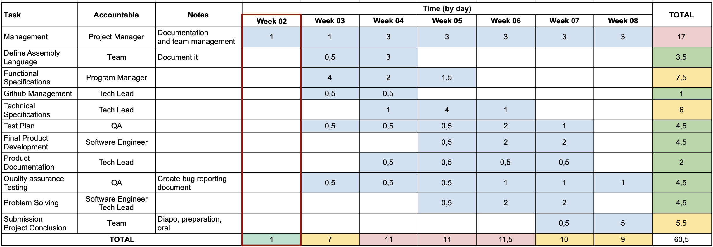

# Weekly Report - 03/19/2023 - 03/25/2024

## Project Overview

- **Project Name:** Virtual Processor
- **Project Manager:** Laura-Lee Hollande
- **Project time (hours):** 00h00
- **What was done:**

## Project Key parameters

<details>

<summary>Glossary</summary>

1. **Schedule:**
   - **On:** The project is progressing according to the planned schedule.
   - **At Risk:** There are concerns about meeting the scheduled deadlines or milestones.
   - **Halted:** The project schedule has come to a temporary stop, possibly due to external factors or critical issues.

2. **Scope:**
   - **On:** The project is proceeding within the defined scope without significant deviations.
   - **At Risk:** There are potential scope creep issues or uncertainties that may impact the project's boundaries.
   - **Halted:** The project has temporarily stopped due to scope-related challenges or changes.

3. **Risks[^1]:**
   - **On:** The identified risks are being effectively managed, and mitigation strategies are in place.
   - **At Risk:** New risks have emerged, or existing risks are not being adequately addressed.
   - **Halted:** The project has stopped or is on hold due to high-risk factors that need resolution.

4. **Issues[^2]:**
   - **On:** Issues are being promptly addressed, and resolution is progressing well.
   - **At Risk:** There are issues that pose a threat to the project's progress and need attention.
   - **Halted:** The project has come to a stop due to critical unresolved issues.

5. **Quality:**
   - **On:** The project is meeting or exceeding quality standards.
   - **At Risk:** There are concerns about the quality of deliverables or processes.
   - **Halted:** The project has temporarily halted due to severe quality issues that need resolution.

</details>

| Component | Status | Comments |
| --------- | ------ | -------- |
| Scope     |        |          |
| Schedule  |        |          |
| Quality   |        |          |

## Project Risks and Issues (Top 5)

| Risk/Issues | Description | Owner | Status |
| ----------- | ----------- | ----- | ------ |
| Risk 1      |             |       |        |
| Risk 2      |             |       |        |
| Risk 3      |             |       |        |
| Risk 4      |             |       |        |
| Risk 5      |             |       |        |

## Project Schedule

This schedule refers to the [Gantt Chart](https://github.com/algosup/2023-2024-project-3-virtual-processor-team-8/blob/management/Management/TeamManagement/ganttCharter.pdf) of this project.



```The current week is highlighted in red and the weeks are based on the real time weeks number.```

## Next week Action Plan

| Action | Description | Owner | Status |
| ------ | ----------- | ----- | ------ |
| /      | /           | /     | /      |

---

[^1]: Risk is any unexpected event that can affect your project — for better or for worse. Risk can affect anything: people, processes, technology, and resources. [...] Risks are events that might happen, and you may not be able to tell when.
*source : [Wrike](https://www.wrike.com/project-management-guide/faq/what-is-risk-in-project-management/)*
[^2]: Issues are things you know you’ll have to deal with, and may even have an idea of when they’ll occur.
*source : [Wrike](https://www.wrike.com/project-management-guide/faq/what-is-risk-in-project-management/)*
